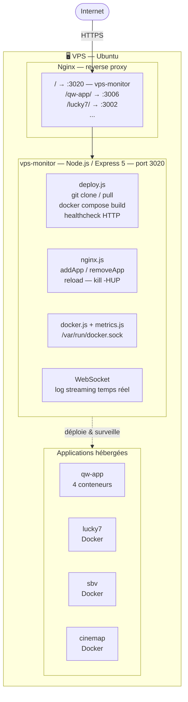
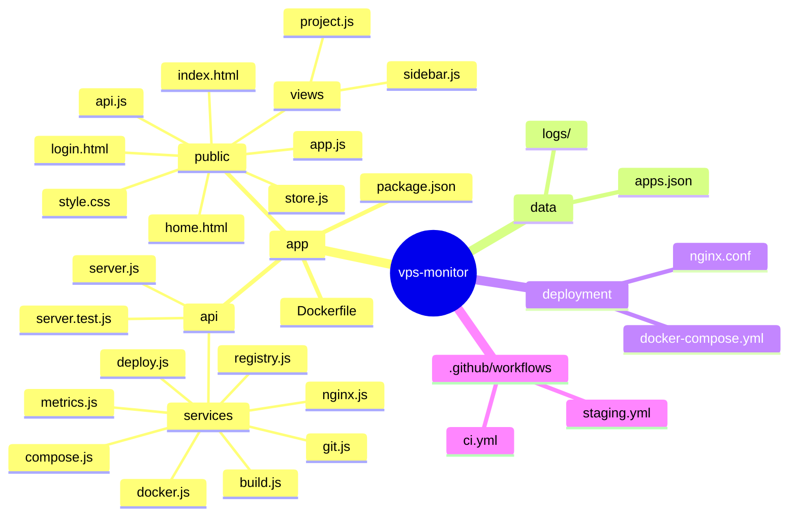

# Dossier de Projet — Concepteur Développeur d'Applications

---

| | |
|---|---|
| **Nom** | PASZKIEWICZ |
| **Prénom** | Damien |
| **Adresse** | Angers 49100 |

**Titre professionnel visé :** Concepteur Développeur d'Applications (CDA) – Niveau 6 (Bac+3)

---

## Remerciements

Je tiens à remercier l'ensemble des personnes qui ont contribué, de près ou de loin, à la réalisation de ce projet ainsi qu'à ma progression tout au long de ma formation.

Je remercie en premier lieu l'équipe pédagogique de MyDigitalSchool Angers pour les enseignements apportés, qui m'ont permis d'acquérir les bases nécessaires en conception, développement et déploiement d'applications.

Je souhaite également remercier le cabinet QW pour m'avoir accueilli dans le cadre de mon stage et pour m'avoir donné l'opportunité de travailler sur un projet concret, en lien direct avec des problématiques métiers réelles.

Enfin, je remercie les différentes personnes avec lesquelles j'ai pu échanger durant cette année (étudiants, intervenants, professionnels), qui ont contribué, à travers leurs retours et leurs expériences, à enrichir ma compréhension du métier de développeur.

---

## Résumé

Ce dossier s'inscrit dans le cadre de la formation Concepteur Développeur d'Applications (CDA) réalisée à MyDigitalSchool Angers. Il présente la conception, le développement et le déploiement d'une application web dédiée à la gestion de la conformité réglementaire LCB-FT, réalisée lors d'un stage au sein du cabinet QW.

L'objectif principal du projet est de centraliser les données clients, de structurer les processus de suivi de conformité et d'améliorer la traçabilité des actions au sein d'une plateforme unique, sécurisée et maintenable.

Pour répondre à ces besoins, une architecture complète a été mise en place, reposant sur un frontend développé avec Next.js 16 et React 19, un backend construit avec NestJS 11 exposant une API REST, ainsi qu'une base de données PostgreSQL 16. L'ensemble de l'application est déployé sur un VPS Linux à l'aide de Docker, avec une approche multi-applications et une automatisation du déploiement via un pipeline CI/CD couplé à vps-monitor.

Ce projet a permis de mobiliser et de développer des compétences clés en conception d'applications, en développement web full-stack, en gestion de bases de données, en sécurité applicative et en déploiement d'infrastructures.

Il met également en évidence une progression réalisée en grande partie en autonomie, avec une montée en compétences progressive basée sur la pratique, l'expérimentation et l'adaptation aux besoins rencontrés.

---

## Sommaire

- [Remerciements](#remerciements)
- [Résumé](#résumé)
- [Liste des acronymes](#liste-des-acronymes)
- [1. Introduction](#1-introduction)
  - [1.1 Contexte de formation](#11-contexte-de-formation)
  - [1.2 Objectif du dossier](#12-objectif-du-dossier)
  - [1.3 Présentation du parcours](#13-présentation-du-parcours)
  - [1.4 Projet retenu pour le dossier](#14-projet-retenu-pour-le-dossier)
- [2. Contexte du projet](#2-contexte-du-projet)
  - [2.1 Présentation de l'entreprise](#21-présentation-de-lentreprise)
  - [2.2 Problématique](#22-problématique)
  - [2.3 Besoin métier](#23-besoin-métier)
- [3. Objectifs du projet](#3-objectifs-du-projet)
- [4. Périmètre du projet](#4-périmètre-du-projet)
- [5. Fonctionnalités](#5-fonctionnalités)
- [6. Conception fonctionnelle](#6-conception-fonctionnelle)
- [7. Conception technique](#7-conception-technique)
- [8. Réalisation technique](#8-réalisation-technique)
- [9. Bilan du projet](#9-bilan-du-projet)
- [10. Conclusion](#10-conclusion)
- [Annexes](#annexes)

---

## Liste des acronymes

| Acronyme | Définition |
|----------|-----------|
| **API** | Application Programming Interface : interface permettant la communication entre différentes applications |
| **CRUD** | Create, Read, Update, Delete : opérations de base sur les données |
| **CI/CD** | Continuous Integration / Continuous Deployment : intégration et déploiement continus |
| **CDA** | Concepteur Développeur d'Applications |
| **CSR** | Client-Side Rendering : rendu côté client |
| **SSR** | Server-Side Rendering : rendu côté serveur |
| **SSG** | Static Site Generation : génération de pages statiques |
| **DTO** | Data Transfer Object : objet de transfert de données |
| **JWT** | JSON Web Token : mécanisme d'authentification basé sur des tokens |
| **RBAC** | Role-Based Access Control : gestion des accès basée sur les rôles |
| **KYC** | Know Your Customer : processus d'identification client |
| **LCB-FT** | Lutte contre le Blanchiment de Capitaux et le Financement du Terrorisme |
| **ORM** | Object-Relational Mapping : technique de liaison entre objets et base de données relationnelle |
| **SQL** | Structured Query Language : langage de gestion des bases de données relationnelles |
| **HTTP** | HyperText Transfer Protocol : protocole de communication web |
| **HTTPS** | HyperText Transfer Protocol Secure : version sécurisée de HTTP |
| **SSH** | Secure Shell : protocole sécurisé d'accès à distance |
| **VPS** | Virtual Private Server : serveur privé virtuel |
| **UI** | User Interface : interface utilisateur |
| **UX** | User Experience : expérience utilisateur |
| **RGPD** | Règlement Général sur la Protection des Données |
| **MVP** | Minimum Viable Product : version minimale fonctionnelle d'un produit |
| **XSS** | Cross-Site Scripting : faille de sécurité liée à l'injection de scripts |
| **CSRF** | Cross-Site Request Forgery : attaque exploitant la session utilisateur |
| **CORS** | Cross-Origin Resource Sharing : mécanisme de contrôle des accès entre origines |
| **UFW** | Uncomplicated Firewall : pare-feu simplifié sous Linux |
| **JSON** | JavaScript Object Notation : format d'échange de données |
| **REST** | Representational State Transfer : architecture d'API web |

---

## 1. Introduction

### 1.1 Contexte de formation

**Formation :** Concepteur Développeur d'Applications (CDA) – MyDigitalSchool Angers  
**Axes :** conception, développement, déploiement (web et mobile)

Dans le cadre de ma formation Concepteur Développeur d'Applications (CDA) au sein de MyDigitalSchool Angers, j'ai suivi un parcours orienté vers la conception, le développement et le déploiement d'applications web et mobiles.

Cette formation vise à former des professionnels capables d'analyser un besoin métier, de concevoir une solution applicative complète et de la développer en respectant les bonnes pratiques de développement, de qualité logicielle et de sécurité.

Au cours de ce cursus, j'ai acquis et consolidé des compétences dans plusieurs domaines clés du développement logiciel, notamment :

- Le développement d'applications web côté frontend et backend ;
- La conception d'architectures applicatives robustes et maintenables ;
- La modélisation de bases de données relationnelles ;
- La mise en place d'API REST ;
- La gestion de projets informatiques dans un contexte professionnel ;
- L'application des bonnes pratiques de sécurité et de qualité logicielle.

### 1.2 Objectif du dossier

Ce dossier vise à mettre en évidence les différentes étapes du projet principal réalisé dans le cadre de la formation, de l'analyse du besoin à la mise en œuvre de la solution, en passant par la conception, le développement et la sécurisation de l'application.

Il a également pour vocation de démontrer l'acquisition des compétences attendues dans le référentiel CDA, notamment en matière de conception applicative, de développement web, de gestion de base de données, de sécurité et de gestion de projet.

### 1.3 Présentation du parcours

Au cours de ma formation, j'ai eu l'opportunité de travailler sur plusieurs projets académiques et personnels, ainsi que de réaliser un stage en entreprise.

#### 1.3.1 Projets réalisés

- My Digital Project — projet transverse mené en équipe pluridisciplinaire avec les filières design, cybersécurité, développement et marketing ;
- Saint Barth Volley — application web pour une association sportive dans laquelle je suis bénévole ;
- Travaux pratiques variés (CineMap TP Laravel, TP Vue.js, etc.) ;
- Projets personnels : monitoring de VPS, bot Discord, jeu de dé.

#### 1.3.2 Stage en entreprise

J'ai effectué un stage au sein du cabinet de conseil QW, spécialisé dans la conformité réglementaire et la gestion des risques, où j'ai développé une application web de gestion de la conformité LCB-FT.

### 1.4 Projet retenu pour le dossier

Le projet principal présenté dans ce dossier est celui réalisé lors de mon stage chez QW. Il constitue le cœur de l'évaluation pour l'obtention du titre CDA.

Plusieurs éléments issus de mes projets personnels ont été réutilisés et enrichissent ce contexte, notamment :

- La mise en place d'un VPS configuré pour héberger plusieurs applications ;
- L'architecture multi-applications basée sur Docker ;
- Un système de monitoring et de déploiement du VPS (vps-monitor).

---

## 2. Contexte du projet

### 2.1 Présentation de l'entreprise

Le projet a été réalisé au sein du cabinet de conseil QW, une structure spécialisée dans l'accompagnement des entreprises sur les enjeux de conformité réglementaire et de gestion des risques.

Le cabinet intervient auprès de clients professionnels afin de les aider à structurer leurs processus internes et à répondre à leurs obligations réglementaires, notamment dans les domaines liés à la lutte contre le blanchiment de capitaux et le financement du terrorisme (LCB-FT).

Il propose un accompagnement basé sur l'analyse des risques, la mise en conformité des organisations et le suivi des obligations réglementaires en vigueur.

### 2.2 Problématique

Actuellement, les processus de gestion de la conformité au sein du cabinet reposent sur l'utilisation de plusieurs outils non centralisés, tels que des fichiers Excel et des documents partagés.

Cette organisation entraîne :

- Une dispersion des informations, rendant difficile la consolidation et l'exploitation des données clients ;
- Une absence de traçabilité : il devient complexe de suivre l'historique des modifications, des analyses réalisées ou des décisions prises sur les dossiers ;
- Des risques d'erreurs, de doublons ou de perte d'informations, impactant directement la fiabilité du suivi des dossiers de conformité.

### 2.3 Besoin métier

Afin de répondre aux limites identifiées, le cabinet exprime plusieurs besoins métiers essentiels :

- Centraliser l'ensemble des données clients et des informations liées aux dossiers au sein d'une plateforme unique ;
- Sécuriser les informations, compte tenu de la sensibilité des données traitées dans le cadre de la conformité LCB-FT (confidentialité, intégrité, protection) ;
- Améliorer le suivi des obligations de conformité, notamment à travers une meilleure traçabilité des actions et une vision plus claire de l'état d'avancement des dossiers.

---

## 3. Objectifs du projet

### 3.1 Objectif principal

L'objectif principal est de concevoir et développer une application web responsive de gestion de la conformité LCB-FT destinée au cabinet QW.

Cette application doit permettre de centraliser l'ensemble des données liées aux clients et aux dossiers de conformité, tout en structurant les processus de traitement et d'analyse, dans un outil unique, fiable et sécurisé.

### 3.2 Objectifs fonctionnels

- **Gestion des clients (KYC) :** création, consultation et mise à jour des informations clients nécessaires à leur identification et à leur suivi (Know Your Customer) ;
- **Scoring des risques :** évaluation automatique du niveau de risque associé à chaque client, permettant de les classer et d'adapter le suivi en conséquence ;
- **Traçabilité :** enregistrement de l'ensemble des actions réalisées sur les dossiers, garantissant un historique complet ;
- **Gestion documentaire :** ajout, stockage et consultation des documents liés aux dossiers clients.

### 3.3 Objectifs techniques

- Mise en place d'une architecture web moderne avec séparation claire entre frontend, backend et base de données ;
- Exposition et consommation d'une API REST pour la communication inter-couches ;
- Sécurisation des données : authentification, protection des échanges, gestion des accès ;
- Système de gestion des rôles (RBAC) pour contrôler les accès aux différentes fonctionnalités.

---

## 4. Périmètre du projet

### 4.1 Inclus dans le périmètre (MVP)

- Gestion des clients : création, modification et consultation des dossiers clients ;
- KYC (Know Your Customer) : saisie et structuration des informations d'identification ;
- Scoring des risques : système d'évaluation du niveau de risque par client ;
- Authentification : système de connexion sécurisé ;
- Gestion des rôles utilisateurs : niveaux d'accès différenciés selon le profil ;
- Audit simple : enregistrement des principales actions effectuées sur les dossiers.

### 4.2 Exclu du périmètre

- Dashboards avancés : tableaux de bord analytiques complexes ;
- Intégrations externes (OFAC, GAFI, etc.) : connexions avec des bases de données de conformité ;
- Système d'alerting avancé : mécanismes automatisés de détection des alertes ;
- Import de données (Excel/CSV) : import automatisé de données ;
- Mise en production réelle : le projet est déployé dans un environnement de test uniquement.

### 4.3 Contraintes

- **Contrainte de temps :** cadre du stage et de la formation, avec durée limitée imposant de prioriser les fonctionnalités essentielles ;
- **MVP obligatoire :** première version fonctionnelle centrée sur les besoins principaux ;
- **Contraintes réglementaires (RGPD) :**
  - Protection des données personnelles ;
  - Limitation de la collecte aux données strictement nécessaires ;
  - Sécurisation des accès et des échanges ;
  - Traçabilité des actions effectuées sur les données ;
- **Environnement de test uniquement :** solution non déployée en production réelle.

---

## 5. Fonctionnalités

### 5.1 Fonctionnalités principales (MVP)

- Gestion des clients : création, modification et consultation des informations clients ;
- Gestion des dossiers : centralisation et organisation des dossiers par client ;
- Gestion des prospects : pipeline de suivi des prospects avant leur conversion en clients ;
- KYC : gestion des informations d'identification conformément aux exigences réglementaires ;
- Scoring des risques : évaluation automatique du niveau de risque ;
- Gestion des documents : ajout, stockage et consultation des fichiers liés aux dossiers ;
- Traçabilité : historique des modifications et des opérations réalisées.

### 5.2 Évolutions envisagées

**Enrichissement des données**

- Récupération automatique des informations légales par numéro SIREN via l'API SIRENE Open Data (data.gouv.fr) ;
- Synchronisation en temps réel avec l'INPI (registre des sociétés, données statutaires) ;
- Collecte automatique des documents d'identité (pièce d'identité, Kbis, etc.) ;
- Cartographie client : visualisation des liens entre entités (actionnaires, mandataires, filiales).

**Onboarding & portefeuille**

- Importation du portefeuille client : import en masse depuis un fichier Excel/CSV ou une solution tierce ;
- Pré-paramétrage multi-dossiers : configuration de modèles de dossiers réutilisables ;
- Gestion multi-cabinet : prise en charge de plusieurs structures au sein d'une même instance.

**Analyse & conformité**

- Amélioration de l'algorithme de scoring : affinage et tests du calcul de niveau de risque ;
- Diligences complémentaires suggérées : recommandation automatique d'actions en fonction du profil de risque ;
- Alertes : notifications sur les événements importants liés aux dossiers (expiration de documents, changement de statut…).

**Gestion commerciale & opérationnelle**

- Génération de propositions commerciales : création de documents personnalisés à partir des données du dossier ;
- Génération de lettres de mission : production automatisée des documents contractuels ;
- Signature électronique via JeSignExpert : intégration pour la signature des documents générés ;
- Notes et informations centralisées : espace de notes partagées associées à chaque dossier ou client ;
- Kanban à étapes personnalisables : tableau de suivi visuel de l'avancement des dossiers (non prioritaire).

**Tableaux de bord & reporting**

- Dashboards analytiques : indicateurs d'activité, répartition des risques, état des dossiers ;
- Exports et rapports : génération de rapports de conformité exportables.

**Technique & intégration**

- Authentification unique (SSO) : intégration avec un fournisseur d'identité existant ;
- API sur mesure : exposition d'endpoints configurables pour des intégrations tierces.

**Offre de service**

- Assistance prioritaire et chargé de compte dédié : niveaux de support différenciés selon l'abonnement.

---

## 6. Conception fonctionnelle

### 6.1 Acteurs du système

- **Collaborateur :** saisie et mise à jour des dossiers clients, alimentation des informations KYC ;
- **Responsable :** validation, supervision et contrôle de la cohérence des dossiers ;
- **Expert-comptable :** analyse des situations complexes, regard réglementaire et financier ;
- **Administrateur :** gestion des comptes, des rôles, des paramètres système et supervision globale.

### 6.2 Cartographie fonctionnelle

*(Schéma à insérer)*

### 6.3 Parcours utilisateurs

#### 6.3.1 Création d'un client

*(Diagramme à insérer)*

#### 6.3.2 Mise à jour KYC

*(Diagramme à insérer)*

#### 6.3.3 Évaluation des risques

*(Diagramme à insérer)*

#### 6.3.4 Validation d'un dossier

*(Diagramme à insérer)*

### 6.4 Maquettes

#### 6.4.1 Wireframes

*(Wireframes à insérer)*

#### 6.4.2 Maquettes

*(Maquettes à insérer)*

### 6.5 Conception de la base de données

La base de données de QW-app est conçue selon la méthodologie Merise, en trois étapes successives : MCD → MLD → MPD. Le SGBD retenu est PostgreSQL 16, accédé via TypeORM (ORM TypeScript). Le schéma est géré via des **migrations** versionnées (pas de synchronisation automatique en production).

#### 6.5.1 Dictionnaire de données

Le dictionnaire recense l'ensemble des informations à stocker dans la base de données. Voir l'[Annexe A1 — Dictionnaire de données](#a1-dictionnaire-de-données).

#### 6.5.2 MCD (Modèle Conceptuel de Données)

Le schéma visuel du MCD est à réaliser avec Looping ou JMerise à partir des entités et associations ci-dessous.

**Entités**

| Entité | Propriétés principales |
|--------|------------------------|
| UTILISATEUR | id, email, password_hash, role, prenom, nom, is_active, last_login_at |
| CLIENT | id, reference, prenom, nom, raison_sociale, email, telephone, statut, deleted_at |
| KYC | id, nationalite, pays_residence, secteur_activite, forme_juridique, est_pep, pays_haut_risque, chiffre_affaires |
| DOCUMENT | id, nom_fichier, chemin_stockage, type_mime, taille |
| SCORE_RISQUE | id, score, niveau, details, calculated_at |
| AUDIT_LOG | id, action, entite_type, entite_id, details, created_at |

**Associations, liaisons et cardinalités**

```
UTILISATEUR (1,n) ────── crée ────── (0,n) CLIENT
   Un utilisateur peut créer 0 ou plusieurs clients.
   Un client est créé par exactement 1 utilisateur.

UTILISATEUR (0,n) ──── valide ──── (0,1) CLIENT
   Un utilisateur peut valider 0 ou plusieurs dossiers.
   Un client peut être validé par au plus 1 utilisateur.

CLIENT (1,1) ──── possède ──── (1,1) KYC
   Un client possède exactement 1 fiche KYC.
   Une fiche KYC appartient à exactement 1 client.

CLIENT (1,n) ──── détient ──── (0,n) DOCUMENT
   Un client peut avoir 0 ou plusieurs documents.
   Un document est rattaché à exactement 1 client.

UTILISATEUR (1,n) ── uploade ── (0,n) DOCUMENT
   Un utilisateur peut uploader 0 ou plusieurs documents.
   Un document est uploadé par exactement 1 utilisateur.

CLIENT (1,n) ──── fait_lobjet ──── (0,n) SCORE_RISQUE
   Un client peut avoir 0 ou plusieurs scores (historique).
   Un score concerne exactement 1 client.

UTILISATEUR (1,n) ── calcule ── (0,n) SCORE_RISQUE
   Un utilisateur peut calculer 0 ou plusieurs scores.
   Un score est calculé par exactement 1 utilisateur.

UTILISATEUR (1,n) ──── genere ──── (0,n) AUDIT_LOG
   Un utilisateur peut générer 0 ou plusieurs entrées d'audit.
   Une entrée d'audit est générée par exactement 1 utilisateur.
```

#### 6.5.3 MLD (Modèle Logique de Données)

Traduction du MCD en tables relationnelles. Les clés primaires sont en MAJUSCULES, les clés étrangères entre [crochets].

```
UTILISATEUR (ID, email, password_hash, role, prenom, nom, is_active, last_login_at, created_at, updated_at)

CLIENT (ID, reference, prenom, nom, raison_sociale, email, telephone, statut, deleted_at, created_at, updated_at,
        [id_createur → UTILISATEUR.id], [id_validateur → UTILISATEUR.id])

KYC (ID, nationalite, pays_residence, secteur_activite, forme_juridique, est_pep, pays_haut_risque,
     chiffre_affaires, created_at, updated_at,
     [id_client → CLIENT.id])                    ← relation 1-1 (UNIQUE)

DOCUMENT (ID, nom_fichier, chemin_stockage, type_mime, taille, created_at,
          [id_client → CLIENT.id], [id_utilisateur → UTILISATEUR.id])

SCORE_RISQUE (ID, score, niveau, details, calculated_at,
              [id_client → CLIENT.id], [id_utilisateur → UTILISATEUR.id])

AUDIT_LOG (ID, action, entite_type, entite_id, details, created_at,
           [id_utilisateur → UTILISATEUR.id])
```

#### 6.5.4 MPD (Modèle Physique de Données)

Implémentation concrète pour PostgreSQL 16 avec TypeORM. Les types sont définis précisément, les contraintes d'intégrité et les index sont inclus. Le schéma est créé via une migration initiale (`InitSchema`). Voir l'[Annexe A2 — MPD SQL](#a2-migration-initiale--initschema-mpd-sql).

---

## 7. Conception technique

### 7.1 Architecture globale

L'architecture de la plateforme repose sur un modèle client-serveur structuré en couches distinctes, garantissant la maintenabilité, la scalabilité et la séparation des responsabilités.

#### 7.1.1 Frontend / Backend / Base de données

- **Frontend (Next.js 16 / React 19) :** interface utilisateur, rendu SSR/CSR, protection des routes via middleware ;
- **Backend (NestJS 11) :** logique métier, traitement des données, exposition des services via API REST ;
- **Base de données (PostgreSQL 16) :** persistance des données et garantie de leur intégrité ;
- **Cache (Redis 7) :** mise en cache des scores de risque calculés (TTL 3600 s).

La communication entre le frontend et le backend s'effectue via une API REST (requêtes HTTP : GET, POST, PUT/PATCH, DELETE). En production, le frontend appelle son propre serveur Next.js (`/api/[...path]`) qui proxy les requêtes vers le backend NestJS — les secrets ne transitent jamais côté client.

#### 7.1.2 Cartographie technique

*(Schéma à insérer)*

### 7.2 Frontend

#### 7.2.1 Next.js 16

Next.js 16 (App Router) a été choisi pour sa capacité à combiner plusieurs modes de rendu (SSR, CSR, SSG), ce qui optimise les performances et le temps de chargement. Son routing basé sur les fichiers simplifie l'organisation du projet. La version 16 apporte notamment la stabilité du App Router et la compatibilité React 19.

#### 7.2.2 React 19 & Tailwind CSS v4

L'interface est construite avec React 19 (composants réutilisables et modulaires) et stylisée avec Tailwind CSS v4 complété par shadcn/ui, garantissant une interface cohérente, responsive et facilement personnalisable.

#### 7.2.3 Pages principales

| Route | Description |
|-------|-------------|
| `/login` | Formulaire d'authentification |
| `/dashboard` | Vue globale (redirection par rôle) |
| `/dashboard/clients` | Listing et création des fiches clients |
| `/dashboard/clients/new` | Formulaire de création d'un client |
| `/dashboard/clients/[id]` | Détail client : KYC, scoring, documents |
| `/dashboard/scoring` | Affichage et suivi des scores de risque |
| `/dashboard/collaborateur` | Vue dédiée au rôle collaborateur |
| `/dashboard/responsable` | Vue dédiée au rôle responsable |
| `/dashboard/admin` | Vue dédiée au rôle administrateur |

### 7.3 Backend

#### 7.3.1 NestJS 11

NestJS 11 a été retenu pour son architecture modulaire basée sur TypeScript, sa séparation claire des responsabilités (modules, services, controllers inspirés d'Angular) et son adaptabilité à la création d'API REST robustes et scalables.

#### 7.3.2 Modules métier

- Module clients : cycle de vie des clients (création, modification, consultation) ;
- Module KYC : structuration des données de connaissance client ;
- Module documents : gestion des fichiers associés aux dossiers ;
- Module utilisateurs : gestion des comptes et des rôles.

#### 7.3.3 Services métier

- Service de scoring : calcul automatique du niveau de risque en fonction de règles définies ;
- Service d'audit : enregistrement des actions pour assurer la traçabilité ;
- Services utilitaires : validation, règles métier transverses.

### 7.4 Base de données

#### 7.4.1 PostgreSQL 16

PostgreSQL 16 a été choisi pour sa robustesse, sa fiabilité et sa conformité aux standards SQL. Il permet de gérer efficacement des données structurées avec des relations complexes.

**Tables principales**

- `clients` : informations d'identification et données KYC ;
- `documents` : métadonnées des fichiers associés ;
- `risk_scores` : historique des scores de risque calculés ;
- `audit_logs` : journalisation des actions effectuées ;
- `users` : gestion des utilisateurs et de leurs rôles ;
- `kycs` : données KYC en relation 1-1 avec clients.

#### 7.4.2 Redis 7

Redis 7 est utilisé comme système de cache en mémoire afin de réduire les requêtes répétitives vers PostgreSQL, notamment pour les scores de risque calculés (clé `scoring:<clientId>`, TTL 3 600 s). Cela améliore les temps de réponse et réduit la charge serveur.

#### 7.4.3 Stockage de documents

Le stockage des documents repose sur un **stockage objet compatible S3** hébergé en Union Européenne, pour un coût d'environ 20 €/mois pour 200 Go — capacité jugée suffisante pour stocker l'ensemble des dossiers clients.

**Solution retenue : stockage objet S3-compatible (EU)**

Deux fournisseurs conformes au cahier des charges (hébergement UE, conformité RGPD, compatibilité S3) :

| Fournisseur | Localisation | Capacité | Coût estimé |
|-------------|-------------|----------|-------------|
| Scaleway Object Storage | Paris (France) | 200 Go | ~15–20 €/mois |
| Hetzner Object Storage | Nuremberg (Allemagne) | 1 To | ~4 €/mois |

La table `documents` conserve uniquement les **métadonnées** (nom du fichier, type MIME, taille, clé S3 de la forme `clients/{clientId}/{uuid}-{nomFichier}`) — le contenu binaire n'est jamais stocké en base de données.

Le backend agit comme intermédiaire exclusif : aucun fichier n'est accessible directement depuis le navigateur. Les téléchargements passent par une **URL signée (Presigned URL)** à durée de vie limitée, générée à la demande par le backend.

---

## 8. Réalisation technique

### 8.1 Environnement de développement

#### 8.1.1 VPS et Linux

L'environnement de développement et de test repose sur un VPS (Virtual Private Server) sous Linux (Ubuntu). Ce choix s'explique par la stabilité, la performance et la compatibilité optimale avec les outils utilisés (Node.js, Docker, Nginx, PostgreSQL).

La configuration du serveur comprend (voir [Annexe E4](#e4-procédure-de-configuration-du-serveur-vps)) :

- Un utilisateur dédié avec des droits restreints ;
- Accès via SSH avec authentification par clé (mot de passe désactivé) ;
- Pare-feu (UFW) limitant les ports exposés (22, 80, 443) ;
- Installation des services nécessaires (Nginx, Docker, PostgreSQL, Redis) ;
- Reverse proxy Nginx pour la gestion des applications.

#### 8.1.2 Outils de développement

- **Visual Studio Code :** éditeur principal, avec support TypeScript/JavaScript, intégration Git, Prettier et ESLint ;
- **Git / GitHub :** gestion de version, branches, pull requests, suivi des issues ;
- **Docker :** conteneurisation des services (frontend, backend, base de données, cache), orchestration via docker-compose.

### 8.2 Base de données

#### 8.2.1 PostgreSQL et TypeORM

La base de données PostgreSQL 16 est accédée via TypeORM. Les entités définissent le schéma et les relations ; la configuration utilise `synchronize: false` en production — les évolutions de schéma passent obligatoirement par des **migrations versionnées** (`npm run migration:generate` / `npm run migration:run`). Un script de **seed** permet d'initialiser les données de test.

**Entités principales :**

| Entité | Contenu |
|--------|---------|
| User | Identifiants, rôle (enum), is_active, last_login_at |
| Client | Informations d'identification, statut du dossier, soft delete |
| Kyc | Données de connaissance client (relation 1-1 avec Client) |
| Document | Métadonnées du fichier, chemin de stockage, client associé |
| RiskScore | Score calculé, niveau (FAIBLE/MOYEN/ÉLEVÉ), détails JSON, client associé |
| AuditLog | Utilisateur, action (enum), entité cible, timestamp |

Les entités sont reliées par des relations TypeORM (`@OneToOne`, `@OneToMany`). `Client` est lié à une `Kyc` (1-1), à plusieurs `RiskScore` (1-N) et à plusieurs `AuditLog` (1-N). Le code de l'entité `Client` est disponible en [Annexe B2](#b2-entité-client).

#### 8.2.2 Cache (Redis)

Redis 7 est utilisé pour mettre en cache les résultats de scoring. La clé Redis est `scoring:<clientId>`, le TTL est de **3 600 secondes** (1 heure). Le cache est populé lors de chaque calcul de score ; les lectures suivantes n'interrogent pas PostgreSQL pour ce score. Cela réduit la charge lors des consultations répétées.

### 8.3 Frontend

#### 8.3.1 Structure et organisation

L'interface est développée avec Next.js 16 (App Router) et React 19. Les composants sont organisés par domaine fonctionnel (clients, dossiers, scoring, documents) dans `src/components/`, et partagent une bibliothèque de composants UI basée sur Tailwind CSS v4.

#### 8.3.2 Design system — shadcn/ui

L'interface du dashboard suit les patterns shadcn/ui : composants accessibles construits sur Radix UI, stylisés avec Tailwind CSS v4 et des variables CSS oklch pour le thème (light/dark). Les composants sont intégrés directement dans `src/components/ui/`.

**Packages utilisés :**

| Catégorie | Packages |
|-----------|----------|
| Primitives UI | `@radix-ui/react-{avatar,checkbox,dialog,dropdown-menu,label,select,separator,slot,tabs,tooltip}` |
| Styling | `class-variance-authority`, `clsx`, `tailwind-merge`, `tw-animate-css` |
| Icônes | `@tabler/icons-react`, `lucide-react` |
| Graphiques | `recharts` |
| Formulaires | `zod` |
| Notifications | `sonner` |

#### 8.3.3 Architecture du dashboard

Le dashboard repose sur un layout `SidebarProvider` qui encapsule toutes les pages de l'espace connecté :

```
SidebarProvider
├── AppSidebar          ← barre latérale collapsible (offcanvas mobile)
│   ├── SidebarHeader   ← logo de l'application
│   ├── SidebarContent
│   │   ├── NavMain     ← navigation principale (icônes Tabler)
│   │   └── NavSecondary ← liens secondaires (Paramètres, Aide)
│   └── SidebarFooter
│       └── NavUser     ← avatar + email + rôle + bouton déconnexion
└── SidebarInset        ← zone de contenu principale
    ├── SiteHeader      ← header de page (titre + breadcrumb)
    └── {children}      ← contenu de la page courante
```

La protection des routes est assurée par un **middleware Next.js** (`proxy.ts`) exécuté côté serveur, qui lit le cookie `qw_token` pour vérifier l'authentification avant tout rendu. Selon le rôle extrait du token, il redirige vers la page de dashboard appropriée (`getDashboardPath(role)`). Le code complet est disponible en [Annexe C2](#c2-middleware--proxysts).

#### 8.3.4 Composant SectionCards — statistiques

Chaque page de vue globale affiche une grille de cartes de statistiques (`SectionCards`). Chaque carte contient un label, une icône colorée (Tabler) et la valeur remontée depuis l'API. Les données sont chargées en parallèle via `Promise.allSettled` au montage de la page, garantissant qu'une erreur sur un endpoint n'empêche pas l'affichage des autres indicateurs.

#### 8.3.5 Pages développées

- `/login` — Formulaire d'authentification, gestion des erreurs, redirection post-connexion ;
- `/dashboard` — Vue globale : redirection automatique vers la page de rôle ;
- `/dashboard/clients` — Listing, création des fiches clients ;
- `/dashboard/clients/new` — Formulaire de création ;
- `/dashboard/clients/[id]` — Détail client : KYC, scoring, documents, historique des actions ;
- `/dashboard/scoring` — Affichage et suivi du niveau de risque par client ;
- `/dashboard/collaborateur` — Vue dédiée : dossiers en cours du collaborateur connecté ;
- `/dashboard/responsable` — Vue dédiée : supervision des dossiers, validation ;
- `/dashboard/admin` — Vue dédiée : gestion des utilisateurs, paramètres système.

#### 8.3.6 Gestion de l'état et des appels API

- **Token stocké dans un cookie** `qw_token` (pas `localStorage`) — inaccessible en JavaScript si `httpOnly`, protège contre le vol par XSS ;
- Appels API centralisés via le helper `apiFetch` (voir [Annexe C3](#c3-helper-apifetch)), qui lit le cookie et injecte le token JWT dans le header `Authorization` ;
- Proxy Next.js (`/api/[...path]/route.ts`) : toutes les requêtes API transitent par le serveur Next.js — le `BACKEND_URL` interne n'est jamais exposé au navigateur ;
- Redirection automatique vers `/login` en cas de token expiré ou absent (géré par le middleware).

#### 8.3.7 Sécurité frontend

- Aucun secret exposé côté client ;
- Token JWT en cookie (protection XSS renforcée vs localStorage) ;
- Protection XSS assurée par l'échappement natif de React ;
- Validation des formulaires via `zod` avant envoi.

### 8.4 Backend

#### 8.4.1 Architecture modulaire (NestJS 11)

Le backend est structuré selon l'architecture modulaire de NestJS 11, avec une séparation claire entre modules, controllers, services et DTOs.

**Modules développés :**

| Module | Responsabilité |
|--------|----------------|
| AuthModule | Authentification JWT, guards, stratégie Passport-JWT |
| UsersModule | Gestion des comptes utilisateurs et des rôles |
| ClientsModule | CRUD clients, cycle de vie des dossiers, soft delete |
| KycModule | Structuration et mise à jour des données KYC |
| DocumentsModule | Upload, stockage et accès contrôlé aux fichiers |
| ScoringModule | Calcul automatique du niveau de risque + cache Redis |
| AuditModule | Journalisation de toutes les actions métier |

#### 8.4.2 Sécurité des endpoints

Chaque route est protégée par un `JwtAuthGuard` et un `RolesGuard` via des décorateurs personnalisés :

```typescript
@Roles(Role.RESPONSABLE, Role.ADMIN)
@UseGuards(JwtAuthGuard, RolesGuard)
@Patch(':id/validate')
validate(@Param('id') id: string) { ... }
```

Un `ValidationPipe` global (`whitelist: true`, `forbidNonWhitelisted: true`, `transform: true`) rejette automatiquement les requêtes non conformes aux DTOs. Le CORS est restreint à `FRONTEND_URL` (variable d'environnement).

#### 8.4.3 Service de scoring

Le service calcule un score de risque sur 100 points basé sur des critères pondérés issus du KYC :

| Critère | Points |
|---------|:------:|
| Client PEP (Personne Politiquement Exposée) | +30 |
| Pays à haut risque | +25 |
| Secteur à risque (crypto, casino, forex, immobilier, luxe…) | +20 |
| Chiffre d'affaires > 500 000 € | +10 |

**Niveaux de risque :**

| Score | Niveau |
|:-----:|--------|
| 0 – 33 | FAIBLE |
| 34 – 66 | MOYEN |
| 67 – 100 | ÉLEVÉ |

Le résultat est persisté en base avec un horodatage pour assurer la traçabilité des réévaluations. Le score calculé est également stocké en cache Redis (clé `scoring:<clientId>`, TTL 3 600 s).

#### 8.4.4 Service d'audit

Chaque action significative (création, modification, validation, consultation de document, calcul de score) déclenche l'enregistrement d'une entrée dans la table `audit_logs` : utilisateur, action (enum `AuditAction`), entité cible, timestamp.

#### 8.4.5 Workflow CRUD — application LCB-FT

Toutes les ressources de l'application (clients, dossiers, KYC, documents) suivent le même flux : chaque requête du frontend traverse une chaîne middleware avant d'atteindre la base de données, et chaque opération d'écriture génère une entrée dans l'audit.

**Chaîne de traitement d'une requête**

```
Browser → Next.js proxy (/api/[...path])
                │
                ▼ BACKEND_URL (interne, non exposé)
Backend (NestJS)
  ├── JwtAuthGuard         // vérifie et décode le JWT
  ├── RolesGuard           // contrôle le rôle requis
  ├── ValidationPipe (DTO) // valide le body (whitelist + transform)
  ├── ClientsController    // reçoit la requête validée
  │     └── ClientsService // logique métier
  │           ├── TypeORM  // → PostgreSQL
  │           └── AuditService // enregistre l'action
  └── response JSON
```

**Matrice des droits par opération**

| Opération | Collaborateur | Responsable | Expert-comptable | Admin |
|-----------|:-------------:|:-----------:|:----------------:|:-----:|
| Créer un client | ✅ | ✅ | ❌ | ✅ |
| Lire la liste | ✅ (ses dossiers) | ✅ (tous) | ✅ (tous) | ✅ |
| Lire le détail | ✅ | ✅ | ✅ | ✅ |
| Modifier KYC | ✅ | ✅ | ❌ | ✅ |
| Valider un dossier | ❌ | ✅ | ❌ | ✅ |
| Consulter les scores | ✅ | ✅ | ✅ | ✅ |
| Accéder aux documents | ✅ | ✅ | ✅ | ✅ |
| Supprimer (soft) | ❌ | ❌ | ❌ | ✅ |

#### 8.4.6 Helper apiFetch (frontend)

Toutes les requêtes passent par un helper centralisé (`apiFetch`) qui lit le cookie `qw_token`, injecte le JWT dans le header `Authorization` et gère l'expiration de session : en cas de 401, l'utilisateur est redirigé vers `/login`. Code complet en [Annexe C3](#c3-helper-apifetch).

#### 8.4.7 Authentification et gestion des rôles

Le système d'authentification de QWapp repose sur JWT, bcrypt et TypeORM, avec :

- **Backend** : double contrôle guard (JwtAuthGuard + RolesGuard) ;
- **Frontend** : middleware Next.js (`proxy.ts`) pour la protection des routes côté serveur ;
- **Token** stocké en **cookie** `qw_token` (plus sécurisé que localStorage).

#### 8.4.8 Entité utilisateur (PostgreSQL / TypeORM)

Le modèle `User` centralise les informations d'authentification et le rôle. Les quatre rôles de l'application sont définis via une enum TypeScript :

```typescript
export enum UserRole {
  COLLABORATEUR    = "collaborateur",
  RESPONSABLE      = "responsable",
  EXPERT_COMPTABLE = "expert-comptable",
  ADMIN            = "admin",
}
```

Le mot de passe n'est jamais stocké en clair : seul le hash bcrypt est persisté. L'entité complète est disponible en [Annexe B1](#b1-entité-user).

#### 8.4.9 Route de login (backend NestJS)

La route `POST /api/auth/login` vérifie l'email, compare le hash bcrypt, met à jour `lastLoginAt`, puis retourne un token JWT signé `{ id, role }`. Deux règles de sécurité clés :

- Même message d'erreur pour email inconnu et mot de passe incorrect (pas d'énumération des comptes) ;
- Un compte avec `isActive: false` est rejeté avant la vérification du mot de passe.

Code complet en [Annexe B5](#b5-authservice--login).

#### 8.4.10 Guards NestJS — JwtAuthGuard et RolesGuard

Le `JwtAuthGuard` (via Passport-JWT) vérifie et décode le token Bearer sur chaque route protégée. Le `RolesGuard` contrôle ensuite que le rôle de l'utilisateur est dans la liste autorisée pour l'endpoint. Implémentations complètes en [Annexe B6](#b6-jwtauthguard-et-rolesguard).

#### 8.4.11 Middleware Next.js — proxy.ts

La protection des routes frontend est assurée côté serveur par un middleware Next.js. Il lit le cookie `qw_token`, décode le JWT (sans secret — vérification de la structure et de l'expiration), et :

- Redirige vers `/login` si absent ou expiré ;
- Redirige vers le dashboard adapté au rôle si accès à `/` ou `/login` alors qu'authentifié ;
- Laisse passer toutes les routes `/dashboard/**` si authentifié.

```typescript
export function proxy(request: NextRequest) {
  const token = request.cookies.get("qw_token")?.value;
  const payload = token ? decodeToken(token) : null;
  const isAuthenticated = !!payload && payload.exp * 1000 > Date.now();

  if (pathname === "/") {
    return isAuthenticated
      ? redirect(getDashboardPath(payload!.role))
      : redirect("/login");
  }
  if (pathname.startsWith("/dashboard")) {
    if (!isAuthenticated) return redirect("/login");
  }
  return NextResponse.next();
}
```

#### 8.4.12 Composant LoginForm (frontend)

Envoie les identifiants au backend via le proxy Next.js, le token retourné est stocké dans le cookie `qw_token`, puis le middleware redirige vers le dashboard adapté au rôle. Les erreurs serveur sont affichées directement dans le formulaire. Code complet en [Annexe C4](#c4-loginform--handlesubmit).

#### 8.4.13 Flux complet de connexion

*(Diagramme à insérer)*

### 8.5 Architecture serveur

#### 8.5.1 Nginx (reverse proxy)

Nginx est utilisé comme serveur web principal et reverse proxy. Il intercepte les requêtes entrantes et les redirige vers les bons services internes en fonction des routes ou des sous-domaines.

**Avantages :**

- Centralisation de l'accès aux différentes applications ;
- Amélioration de la sécurité en masquant les services internes ;
- Simplification de la gestion des certificats HTTPS ;
- Meilleure organisation du trafic réseau.

La configuration Nginx est désormais **gérée dynamiquement** par vps-monitor v2, qui peut ajouter ou supprimer des entrées à la volée lors du déploiement de nouveaux projets.

#### 8.5.2 Architecture multi-applications

Le serveur héberge plusieurs applications simultanément sur un même VPS. Chaque application est isolée dans son propre ensemble de conteneurs Docker et accessible via une route spécifique dans Nginx. La gestion de cette infrastructure est centralisée dans **vps-monitor v2** (voir [section 8.8.5](#885-monitoring-et-déploiement--vps-monitor-v2)).

### 8.6 Sécurité et conformité

#### 8.6.1 Authentification (JWT)

L'authentification repose sur des JSON Web Tokens (JWT) signés avec une clé secrète stockée en variable d'environnement. Le token contient le `id` et le `role` de l'utilisateur.

Côté frontend, le token est stocké dans un **cookie** `qw_token` (et non en `localStorage`), ce qui le protège de l'accès JavaScript en cas d'attaque XSS si le flag `httpOnly` est activé. Il est transmis dans le header `Authorization: Bearer <token>` à chaque appel API.

#### 8.6.2 Autorisation (RBAC)

Le système d'autorisation repose sur un contrôle d'accès basé sur les rôles (RBAC). Chaque utilisateur est associé à un rôle (collaborateur, responsable, expert-comptable, admin) qui détermine ses permissions.

La gestion des autorisations est implémentée côté backend via des guards NestJS (`JwtAuthGuard` + `RolesGuard`) et côté frontend via le middleware Next.js (`proxy.ts`). Cela permet de respecter le principe du moindre privilège.

#### 8.6.3 Validation des données

La validation des données entrantes repose sur des DTO avec les bibliothèques `class-validator` et `class-transformer`. Le `ValidationPipe` global (`whitelist: true`, `forbidNonWhitelisted: true`) rejette automatiquement les requêtes non conformes et supprime les champs non déclarés dans le DTO.

#### 8.6.4 Protection contre les attaques

- **XSS :** React échappe les données affichées ; token en cookie (protection supplémentaire vs localStorage) ;
- **CSRF :** l'architecture JWT (token dans les headers) et une configuration CORS restrictive (`FRONTEND_URL`) limitent fortement ce risque ;
- **Injection SQL :** toutes les interactions avec la base de données passent par TypeORM (requêtes paramétrées) ;
- **Rate limiting :** à mettre en place pour les endpoints sensibles.

#### 8.6.5 Sécurité serveur

- **SSH :** authentification par clé uniquement, utilisateur dédié distinct du compte root ;
- **Firewall (UFW) :** seuls les ports 22 (SSH), 80 (HTTP) et 443 (HTTPS) sont ouverts ;
- **HTTPS :** certificat SSL/TLS via Nginx pour chiffrer les données en transit.

#### 8.6.6 Sécurité des documents

Les documents LCB-FT contiennent des données personnelles et financières sensibles. Plusieurs couches de protection sont mises en place.

**Contrôle d'accès**

Aucun fichier n'est accessible directement via URL publique. Toute requête passe obligatoirement par le backend, qui vérifie l'authentification JWT, le rôle et l'appartenance du dossier avant toute opération. Chaque accès est journalisé dans `audit_logs`.

**Bucket privé et permissions minimales**

Le bucket S3 est configuré en accès privé strict. Un seul compte IAM dédié au backend dispose de permissions restreintes (`GetObject`, `PutObject`, `DeleteObject`) sur ce bucket uniquement — le compte ne peut ni lister tous les buckets ni accéder à d'autres ressources.

**Chiffrement**

- **Au repos :** chiffrement AES-256 activé côté fournisseur (SSE) ;
- **En transit :** HTTPS/TLS sur tous les échanges.

Pour un niveau de protection maximal, un **chiffrement côté application** peut être activé : le backend chiffre le fichier avant l'upload avec une clé gérée en variable d'environnement — le contenu reste illisible même pour le fournisseur de stockage.

**URLs signées (Presigned URLs)**

Pour les téléchargements, le backend génère une URL signée à courte durée de vie (TTL 15 minutes maximum) plutôt que de streamer le fichier. Le flux est le suivant :

```
Client → GET /api/documents/:id/download
Backend → vérifie JWT + rôle + appartenance du dossier
        → enregistre la consultation dans audit_logs
        → génère une Presigned URL (TTL 15 min)
        → retourne l'URL au client
Client → télécharge directement depuis le stockage (lien à usage unique)
```

**Séparation des environnements**

Deux buckets distincts sont utilisés (`qw-app-staging` et `qw-app-prod`) : aucune donnée réelle ne transite dans l'environnement de test.

#### 8.6.7 RGPD

- **Minimisation des données :** seules les données strictement nécessaires au KYC et à l'évaluation des risques sont collectées ;
- **Droits des utilisateurs :** droit d'accès, de rectification, d'effacement (dans les limites légales), de limitation et à la portabilité ;
- **Durée de conservation :** 5 ans à compter de la fin de la relation d'affaires, conformément aux obligations LCB-FT (soft delete avec `deletedAt`) ;
- **Privacy by design :** sécurité intégrée dès la conception ;
- **Traçabilité (accountability) :** journalisation de toutes les actions sur les données via le système d'audit.

### 8.7 Tests

#### 8.7.1 Stratégie de tests

La stratégie de tests repose sur une approche progressive. Des tests unitaires ont été mis en place pour les services métier principaux, avec un rapport de couverture généré via `jest --coverage`.

**Tests unitaires implémentés**

Des fichiers `.spec.ts` existent pour les services suivants :

- `audit.service.spec.ts` — service d'audit ;
- `clients.service.spec.ts` — service clients (CRUD, soft delete) ;
- `documents.service.spec.ts` — service documents ;
- `kyc.service.spec.ts` — service KYC ;
- `scoring.service.spec.ts` — algorithme de scoring.

Les tests utilisent des mocks pour isoler les dépendances (repositories TypeORM, client Redis). Le coverage est exporté en formats LCOV et Clover (intégration CI potentielle).

**Tests end-to-end**

Un fichier `test/app.e2e-spec.ts` est présent pour les tests d'intégration, utilisant SuperTest pour simuler des requêtes HTTP réelles.

#### 8.7.2 Cas de tests

**Scoring de risque — cas testés**

| Cas | Score attendu | Niveau |
|-----|:-------------:|--------|
| Client sans facteur de risque | 0 | FAIBLE |
| PEP seul | 30 | FAIBLE |
| PEP + pays haut risque | 55 | MOYEN |
| PEP + pays haut risque + secteur crypto | 75 | ÉLEVÉ |
| Tous les critères actifs | 85 | ÉLEVÉ |

**Authentification — cas testés**

- Connexion avec identifiants valides ;
- Connexion avec mot de passe incorrect (même message d'erreur) ;
- Accès à une route protégée sans token → 401 ;
- Accès à une route avec rôle insuffisant → 403.

#### 8.7.3 Résultats

Les tests unitaires et le rapport de couverture sont générés par `npm run test:cov` dans le répertoire `backend/`. Les résultats sont exportés dans `backend/coverage/` (LCOV, Clover). La couverture couvre l'ensemble des services métier.

### 8.8 Déploiement & infrastructure

#### 8.8.1 Cartographie de déploiement

*(Schéma à insérer)*

#### 8.8.2 Architecture de déploiement

L'application est déployée sur un VPS utilisé comme environnement de test. Tous les services sont conteneurisés via Docker et orchestrés avec docker-compose.

**Services Docker — qw-app :**

| Conteneur | Image | Port hôte | Port interne |
|-----------|-------|:---------:|:------------:|
| `qw-app-frontend` | Build custom | 127.0.0.1:3006 | 3000 |
| `qw-app-backend` | Build custom | 127.0.0.1:3008 | 3001 |
| `qw-app-postgres` | `postgres:16-alpine` | — (interne) | 5432 |
| `qw-app-redis` | `redis:7-alpine` | — (interne) | 6379 |

Le backend attend que PostgreSQL soit `healthy` avant de démarrer (healthcheck `pg_isready`). Le frontend attend que le backend soit démarré.

Nginx assure la répartition des requêtes entre les différentes applications selon la configuration définie, gérée dynamiquement par vps-monitor.

#### 8.8.3 Environnement de test (staging)

L'application est déployée dans un environnement de type staging, permettant de valider les développements dans des conditions proches de la production, sans utilisateurs réels. Aucune mise en production réelle n'a été effectuée dans le cadre du projet.

#### 8.8.4 Procédure de déploiement (CD)

Le déploiement est entièrement automatisé via GitHub Actions + **vps-monitor webhook**. À chaque push sur la branche `staging`, le workflow `staging.yml` :

1. Appelle le webhook de vps-monitor via une requête HTTP authentifiée ;
2. vps-monitor exécute le pipeline de déploiement côté VPS (git pull, docker compose build, healthcheck).

```yaml
# .github/workflows/staging.yml
- name: Trigger deploy via vps-monitor webhook
  run: |
    curl -f -s -X POST "${{ secrets.VPS_MONITOR_URL }}/api/webhook/deploy" \
      -H "Authorization: Bearer ${{ secrets.WEBHOOK_SECRET }}" \
      -H "Content-Type: application/json" \
      -d '{"name": "qw-app"}'
```

Cette approche découple le CI (GitHub) du déploiement effectif (VPS) et centralise la gestion des déploiements dans vps-monitor. Les logs de build sont streamés en temps réel via WebSocket.

**Secrets GitHub requis :**

| Secret | Usage |
|--------|-------|
| `VPS_MONITOR_URL` | URL de l'instance vps-monitor |
| `WEBHOOK_SECRET` | Token Bearer pour authentifier la requête |

#### 8.8.5 Monitoring et déploiement — vps-monitor v2

vps-monitor a été entièrement refondu en **mini-plateforme de déploiement** (inspiré de Railway / Coolify), capable de gérer le cycle de vie complet des applications hébergées sur le VPS.

**Architecture v2**

```
vps-monitor
├── api/
│   ├── server.js              ← Express 5 + WebSocket (ws)
│   └── services/
│       ├── deploy.js          ← pipeline git clone → build → healthcheck
│       ├── build.js           ← sessions de build avec log streaming
│       ├── compose.js         ← opérations docker compose
│       ├── git.js             ← opérations git
│       ├── docker.js          ← Dockerode (conteneurs)
│       ├── metrics.js         ← CPU/RAM en temps réel (Docker stats)
│       ├── nginx.js           ← gestion dynamique de la config Nginx
│       └── registry.js        ← registre JSON des projets (apps.json)
├── public/
│   ├── app.js / api.js / store.js ← frontend vanilla JS
│   └── views/project.js / sidebar.js
└── data/
    ├── apps.json              ← registre persistant des projets
    └── logs/                  ← logs de build par déploiement
```

**Fonctionnalités**

*Gestion de projets :*

- Créer / modifier / supprimer un projet (id, nom, gitUrl, branche, route Nginx, port) ;
- Registre persistant dans `data/apps.json` ;
- Historique des déploiements par projet.

*Pipeline de déploiement :*

1. `git clone` ou `git pull` du dépôt ;
2. Écriture optionnelle du fichier `.env` ;
3. `docker compose build` + `docker compose up -d` ;
4. Healthcheck HTTP (timeout 30 s, requêtes toutes les 2 s) ;
5. Statut final : `success` ou `failed` + durée.

*Logs en temps réel (WebSocket) :*

- Jeton WS à usage unique (`GET /api/ws-token`) ;
- Stream des logs de build en direct pendant le déploiement ;
- Stream des logs de conteneur (`docker logs --follow`) ;
- Lecture des logs persistés après coup.

*Monitoring des conteneurs :*

- Listing des conteneurs avec statut (running / stopped / restarting) ;
- Métriques CPU (%) et mémoire (usage / limite / %) via Docker stats ;
- Actions : restart, stop, start, remove, exec.

*Gestion Nginx dynamique :*

- Ajout / suppression de routes à la volée ;
- Rechargement Nginx sans interruption (`kill -HUP <pid>`) ;
- Lecture / écriture de la config `/etc/nginx/sites-available/vps`.

*Webhook CD :*

- `POST /api/webhook/deploy` ou `POST /api/webhook/:id` ;
- Authentification par token Bearer (`WEBHOOK_SECRET`).

**Projets enregistrés (apps.json)**

| ID | Dépôt | Route Nginx | Port |
|----|-------|-------------|:----:|
| `qw-app` | RustyRory/qw-app | `/qw-app/` | 3006 |
| `CollegeLaBoussole` | RustyRory/CollegeLaBoussole | `/collegelaboussole/` | 3007 |
| `sbv` | RustyRory/SaintBarthVolley | `/saintbarthvolley/` | 3001 |
| `lucky7` | RustyRory/Lucky7 | `/lucky7/` | 3002 |
| `cinemap` | RustyRory/cinemap | `/cinemap/` | 3004 |
| `tp-vue` | RustyRory/B3dev-TP_VUE | `/B3dev-TP_VUE/` | 3005 |

### 8.9 CI / CD

#### 8.9.1 Intégration continue (CI) — qw-app

L'intégration continue de qw-app repose sur **Husky** et **commitlint** en local, sans workflow CI dédié sur GitHub Actions.

**Hooks locaux (Husky)**

- `pre-commit` : exécute lint-staged (lint + Prettier) sur les fichiers modifiés ;
- `commit-msg` : valide le format des messages de commit via commitlint.

La convention de commit est définie dans `commitlint.config.js` (format Conventional Commits).

#### 8.9.2 Déploiement continu (CD) — qw-app

Un seul workflow `staging.yml` gère le déploiement via le **webhook vps-monitor** :

```yaml
name: Deploy staging
on:
  push:
    branches: [staging]
jobs:
  deploy:
    runs-on: ubuntu-latest
    steps:
      - name: Trigger deploy via vps-monitor webhook
        run: |
          curl -f -s -X POST "${{ secrets.VPS_MONITOR_URL }}/api/webhook/deploy" \
            -H "Authorization: Bearer ${{ secrets.WEBHOOK_SECRET }}" \
            -H "Content-Type: application/json" \
            -d '{"name": "qw-app"}'
```

Le pipeline de build (git pull, docker compose build, healthcheck) est intégralement géré par vps-monitor côté VPS.

#### 8.9.3 CI / CD — vps-monitor

vps-monitor dispose de deux workflows GitHub Actions :

**ci.yml** — déclenché sur chaque push et PR :

```yaml
jobs:
  ci:
    steps:
      - npm ci (working-directory: app)
      - npm run lint
      - npm test
```

**staging.yml** — déclenché sur push vers `staging` :

```yaml
steps:
  - SSH deploy
  - cd /var/www/vps-monitor && git pull origin staging
  - docker compose -f deployment/docker-compose.yml build
  - docker compose -f deployment/docker-compose.yml up -d --remove-orphans
```

#### 8.9.4 Versioning et releases

Le projet qw-app suit un Git Flow simplifié :

| Branche | Rôle |
|---------|------|
| `main` | Version stable |
| `staging` | Environnement de test / déploiement automatique |
| `dev` | Intégration des développements |
| `feat/*` / `feature/*` | Nouvelles fonctionnalités |
| `fix/*` | Corrections de bugs |
| `hotfix/*` | Corrections urgentes sur main |

#### 8.9.5 Limites

- Absence de workflow CI dédié sur GitHub Actions pour qw-app (lint/tests exécutés uniquement en local via Husky) ;
- Pipeline adapté à un projet individuel ;
- Absence d'environnement de production distinct ;
- Couverture de tests partielle.

Ces choix restent cohérents avec le cadre du projet (stage et formation) et les contraintes de temps.

### 8.10 Hébergement

#### 8.10.1 VPS

L'application est hébergée sur un VPS (Virtual Private Server), offrant un contrôle total sur l'infrastructure à faible coût (~5€/mois). Configuration typique : 1-2 cœurs CPU, 2-4 Go de RAM, stockage SSD.

**Avantages :**

- Coût faible et maîtrisé ;
- Contrôle total de la configuration serveur ;
- Compatible avec une architecture multi-applications ;
- Reproduction d'un environnement proche de la production.

**Limites :**

- Ressources limitées en cas de montée en charge ;
- Absence de haute disponibilité native ;
- Maintenance entièrement à la charge du développeur.

#### 8.10.2 Stockage des fichiers

Deux solutions sont envisagées (voir [section 7.4.3](#743-stockage-de-documents)). Dans les deux cas, l'application abstrait le système de stockage, permettant de changer de solution sans modifier la logique métier.

---

## 9. Bilan du projet

### 9.1 Objectifs atteints

Le projet a permis de répondre aux objectifs principaux définis en début de mission.

Sur le plan fonctionnel, une application web permettant de centraliser les données clients, de gérer les informations KYC, d'évaluer les risques et d'assurer une traçabilité des actions a été développée. Les fonctionnalités essentielles attendues dans le cadre d'un MVP ont été implémentées et sont opérationnelles dans un environnement de test.

Sur le plan technique, plusieurs objectifs ont été atteints :

- Mise en place d'une architecture complète frontend / backend / base de données ;
- Développement d'une API REST structurée avec NestJS 11 ;
- Implémentation d'un système d'authentification sécurisé (JWT + cookie) et de gestion des rôles (RBAC) ;
- Protection des routes frontend par middleware Next.js (serveur-side) ;
- Utilisation d'une base de données relationnelle (PostgreSQL 16) avec ORM et migrations ;
- Déploiement sur un VPS Linux avec une architecture Docker multi-applications ;
- Pipeline CI/CD automatisé via vps-monitor webhook.

Le projet constitue ainsi une solution fonctionnelle cohérente, répondant aux besoins principaux du client dans le cadre du stage.

### 9.2 Difficultés rencontrées

La principale difficulté rencontrée tout au long du projet a été liée à un manque de connaissances initiales et de bonnes pratiques.

Une grande partie des choix techniques et des implémentations ont été réalisés de manière empirique, en apprenant directement au moment du besoin. Cela a entraîné :

- Des hésitations dans les choix d'architecture ;
- Des phases de refactorisation après coup (ex. passage de localStorage à un cookie pour le token JWT) ;
- Une perte de temps liée à des erreurs ou à des approches non optimales ;
- Une difficulté à anticiper certains besoins (scalabilité, monitoring, organisation).

Par ailleurs, le fait d'avoir travaillé majoritairement en autonomie a limité les échanges techniques et le recul critique qu'aurait pu apporter un développeur plus expérimenté.

### 9.3 Solutions apportées

Face à ces difficultés, une approche progressive et itérative a été adoptée. Les solutions ont été construites au fur et à mesure des besoins, avec une logique d'amélioration continue :

- Ajout de nouvelles fonctionnalités en réponse aux problématiques rencontrées ;
- Refonte partielle de certaines parties du projet après acquisition de nouvelles compétences ;
- Mise en place progressive de bonnes pratiques (modularisation, sécurité, structuration du code) ;
- Évolution de l'infrastructure (passage d'un déploiement SSH manuel à un pipeline webhook via vps-monitor) ;
- Développement et refonte complète de vps-monitor en plateforme de déploiement autonome.

Cette démarche, bien que moins structurée au départ, a permis de faire évoluer le projet de manière concrète et pragmatique.

### 9.4 Améliorations possibles

Plusieurs axes d'amélioration ont été identifiés pour faire évoluer le projet vers une solution plus robuste et professionnelle :

- Amélioration de la qualité du code et refactorisation de certaines parties ;
- Augmentation de la couverture de tests (tests e2e avec base de données dédiée) ;
- Mise en place d'un monitoring plus avancé (métriques VPS, logs centralisés) ;
- Amélioration de la sécurité (cookie `httpOnly` + `Secure`, refresh token, rate limiting) ;
- Optimisation de l'architecture pour une meilleure scalabilité ;
- Ajout de fonctionnalités non incluses dans le MVP (dashboards, alertes, imports de données).

Ces améliorations s'inscrivent dans une logique de passage d'un projet de formation à un projet plus proche d'un environnement de production réel.

### 9.5 Perspectives

À court terme, une évolution naturelle du projet serait la mise en place d'un environnement de production distinct, avec une infrastructure plus robuste et sécurisée.

À moyen terme, le projet pourrait être enrichi avec :

- Des outils d'analyse avancés pour le suivi des risques ;
- Des intégrations externes (bases réglementaires, APIs métiers) ;
- Un système d'alerting automatisé ;
- Une amélioration de l'expérience utilisateur.

Sur le plan personnel, ce projet constitue une base solide qui pourra être réutilisée et améliorée dans des contextes professionnels futurs.

---

## 10. Conclusion

Ce projet s'inscrit pleinement dans les objectifs de la formation Concepteur Développeur d'Applications (CDA) en couvrant l'ensemble du cycle de vie d'une application : de l'analyse du besoin à la conception, au développement, à la sécurisation et au déploiement.

Il m'a permis de développer des compétences clés du référentiel :

- Concevoir une application sécurisée répondant à un besoin métier ;
- Mettre en place une architecture en couches claire et maintenable ;
- Déployer une application dans un environnement proche de la production ;
- Appliquer des bonnes pratiques en matière de sécurité et de gestion des données.

Au-delà des compétences techniques, ce projet m'a surtout permis de progresser sur ma capacité à apprendre en autonomie, à résoudre des problèmes concrets et à faire évoluer une application dans le temps.

Il met également en évidence certains axes d'amélioration, notamment sur la maîtrise des bonnes pratiques et la structuration des projets, que je souhaite approfondir dans la suite de mon parcours.

Mon objectif est désormais de m'insérer durablement dans le monde professionnel en tant que développeur, au sein d'une structure dans laquelle je pourrai continuer à progresser, être encadré et m'épanouir.

Dans cette optique, la poursuite de mes études en master développement full-stack à MyDigitalSchool constitue une opportunité concrète pour renforcer mes compétences techniques et consolider mon profil professionnel.

---

## Annexes

### Diagrammes

#### USE CASE

*(Diagramme à insérer)*

#### Diagrammes de séquence

*(Mise à jour KYC, Validation d'un dossier, Flux de connexion — à insérer)*

#### Captures d'écran

*(Captures à insérer)*

---

### A. Base de données

#### A1. Dictionnaire de données

##### Table `users`

| Champ | Type SQL | Contraintes | Description |
|-------|----------|-------------|-------------|
| id | UUID | PK, DEFAULT uuid_generate_v4() | Identifiant unique |
| email | VARCHAR(255) | UNIQUE, NOT NULL | Adresse email (identifiant de connexion) |
| passwordHash | VARCHAR(255) | NOT NULL | Hash bcrypt du mot de passe |
| role | ENUM | NOT NULL, DEFAULT 'collaborateur' | Rôle : collaborateur, responsable, expert-comptable, admin |
| prenom | VARCHAR(100) | NOT NULL | Prénom |
| nom | VARCHAR(100) | NOT NULL | Nom de famille |
| isActive | BOOLEAN | NOT NULL, DEFAULT true | Compte actif ou désactivé |
| lastLoginAt | TIMESTAMPTZ | NULL | Date et heure de la dernière connexion |
| createdAt | TIMESTAMPTZ | NOT NULL, DEFAULT now() | Date de création |
| updatedAt | TIMESTAMPTZ | NOT NULL, DEFAULT now() | Date de dernière modification |

##### Table `clients`

| Champ | Type SQL | Contraintes | Description |
|-------|----------|-------------|-------------|
| id | UUID | PK, DEFAULT uuid_generate_v4() | Identifiant unique |
| reference | VARCHAR(50) | UNIQUE, NOT NULL | Référence interne du dossier |
| prenom | VARCHAR(100) | NOT NULL | Prénom du client |
| nom | VARCHAR(100) | NOT NULL | Nom de famille |
| raisonSociale | VARCHAR(200) | NULL | Raison sociale (entité morale) |
| email | VARCHAR(255) | NULL | Email du client |
| telephone | VARCHAR(20) | NULL | Numéro de téléphone |
| statut | ENUM | NOT NULL, DEFAULT 'en_cours' | Statut : en_cours, valide, rejete |
| deletedAt | TIMESTAMPTZ | NULL | Soft delete — date de suppression logique |
| createdAt | TIMESTAMPTZ | NOT NULL | Date de création du dossier |
| updatedAt | TIMESTAMPTZ | NOT NULL | Date de dernière modification |
| id_createur | UUID | FK → users.id, NOT NULL | Utilisateur ayant créé le dossier |
| id_validateur | UUID | FK → users.id, NULL | Utilisateur ayant validé le dossier |

##### Table `kyc`

| Champ | Type SQL | Contraintes | Description |
|-------|----------|-------------|-------------|
| id | UUID | PK, DEFAULT uuid_generate_v4() | Identifiant unique |
| nationalite | VARCHAR(100) | NULL | Nationalité du client |
| paysResidence | VARCHAR(100) | NULL | Pays de résidence |
| secteurActivite | VARCHAR(200) | NULL | Secteur d'activité |
| formeJuridique | VARCHAR(100) | NULL | Forme juridique |
| estPep | BOOLEAN | NOT NULL, DEFAULT false | Personne Politiquement Exposée (PEP) |
| paysHautRisque | BOOLEAN | NOT NULL, DEFAULT false | Pays classé à haut risque (GAFI) |
| chiffreAffaires | DECIMAL(15,2) | NULL | Chiffre d'affaires annuel (€) |
| createdAt | TIMESTAMPTZ | NOT NULL | Date de création |
| updatedAt | TIMESTAMPTZ | NOT NULL | Date de mise à jour |
| id_client | UUID | FK → clients.id, UNIQUE, NOT NULL | Client associé (relation 1-1) |

##### Table `risk_scores`

| Champ | Type SQL | Contraintes | Description |
|-------|----------|-------------|-------------|
| id | UUID | PK, DEFAULT uuid_generate_v4() | Identifiant unique |
| score | SMALLINT | NOT NULL | Score calculé (0–100) |
| niveau | ENUM | NOT NULL | Niveau de risque : faible, moyen, eleve |
| details | JSONB | NULL | Détail des critères activés et leur poids |
| calculatedAt | TIMESTAMPTZ | NOT NULL, DEFAULT NOW() | Horodatage du calcul |
| id_client | UUID | FK → clients.id, NOT NULL | Client évalué |
| id_utilisateur | UUID | FK → users.id, NOT NULL | Utilisateur ayant déclenché le calcul |

##### Table `documents`

| Champ | Type SQL | Contraintes | Description |
|-------|----------|-------------|-------------|
| id | UUID | PK, DEFAULT uuid_generate_v4() | Identifiant unique |
| nomFichier | VARCHAR(255) | NOT NULL | Nom original du fichier |
| cheminStockage | VARCHAR(500) | NOT NULL | Chemin de stockage sur le serveur |
| typeMime | VARCHAR(100) | NOT NULL | Type MIME du fichier |
| taille | BIGINT | NOT NULL | Taille du fichier en octets |
| createdAt | TIMESTAMPTZ | NOT NULL | Date d'upload |
| id_client | UUID | FK → clients.id, NOT NULL | Client auquel appartient le document |
| id_utilisateur | UUID | FK → users.id, NOT NULL | Utilisateur ayant uploadé le document |

##### Table `audit_logs`

| Champ | Type SQL | Contraintes | Description |
|-------|----------|-------------|-------------|
| id | UUID | PK, DEFAULT uuid_generate_v4() | Identifiant unique |
| action | ENUM | NOT NULL | Action : CREATE, UPDATE, DELETE, READ, VALIDATE, LOGIN |
| entiteType | VARCHAR(50) | NOT NULL | Nom de la ressource concernée (ex. Client) |
| entiteId | UUID | NOT NULL | Identifiant de l'entité concernée |
| details | JSONB | NULL | Données contextuelles (ex. `{ score: 55, niveau: "moyen" }`) |
| createdAt | TIMESTAMPTZ | NOT NULL | Horodatage de l'action |
| id_utilisateur | UUID | FK → users.id, NOT NULL | Utilisateur ayant effectué l'action |

#### A2. Migration initiale — InitSchema (MPD SQL)

Fichier `backend/src/migrations/1780063741545-InitSchema.ts`, exécuté via `npm run migration:run`. Crée l'intégralité du schéma en une seule migration versionnée.

```sql
-- Types ENUM
CREATE TYPE "public"."users_role_enum"
  AS ENUM('collaborateur', 'responsable', 'expert-comptable', 'admin');
CREATE TYPE "public"."clients_statut_enum"
  AS ENUM('en_cours', 'valide', 'rejete');
CREATE TYPE "public"."risk_scores_niveau_enum"
  AS ENUM('faible', 'moyen', 'eleve');
CREATE TYPE "public"."audit_logs_action_enum"
  AS ENUM('CREATE', 'UPDATE', 'DELETE', 'READ', 'VALIDATE', 'LOGIN');

-- Table kyc
CREATE TABLE "kyc" (
  "id"               uuid NOT NULL DEFAULT uuid_generate_v4(),
  "nationalite"      character varying(100),
  "paysResidence"    character varying(100),
  "secteurActivite"  character varying(200),
  "formeJuridique"   character varying(100),
  "estPep"           boolean NOT NULL DEFAULT false,
  "paysHautRisque"   boolean NOT NULL DEFAULT false,
  "chiffreAffaires"  numeric(15,2),
  "createdAt"        TIMESTAMP WITH TIME ZONE NOT NULL DEFAULT now(),
  "updatedAt"        TIMESTAMP WITH TIME ZONE NOT NULL DEFAULT now(),
  "id_client"        uuid NOT NULL,
  UNIQUE ("id_client"),
  PRIMARY KEY ("id")
);

-- Table documents
CREATE TABLE "documents" (
  "id"              uuid NOT NULL DEFAULT uuid_generate_v4(),
  "nomFichier"      character varying(255) NOT NULL,
  "cheminStockage"  character varying(500) NOT NULL,
  "typeMime"        character varying(100) NOT NULL,
  "taille"          bigint NOT NULL,
  "createdAt"       TIMESTAMP WITH TIME ZONE NOT NULL DEFAULT now(),
  "id_client"       uuid NOT NULL,
  "id_utilisateur"  uuid NOT NULL,
  PRIMARY KEY ("id")
);
CREATE INDEX "idx_documents_id_client" ON "documents" ("id_client");

-- Table risk_scores
CREATE TABLE "risk_scores" (
  "id"              uuid NOT NULL DEFAULT uuid_generate_v4(),
  "score"           smallint NOT NULL,
  "niveau"          "public"."risk_scores_niveau_enum" NOT NULL,
  "details"         jsonb,
  "calculatedAt"    TIMESTAMP WITH TIME ZONE NOT NULL DEFAULT NOW(),
  "id_client"       uuid NOT NULL,
  "id_utilisateur"  uuid NOT NULL,
  PRIMARY KEY ("id")
);
CREATE INDEX "idx_risk_scores_id_client" ON "risk_scores" ("id_client");

-- Table clients
CREATE TABLE "clients" (
  "id"            uuid NOT NULL DEFAULT uuid_generate_v4(),
  "reference"     character varying(50) NOT NULL,
  "prenom"        character varying(100) NOT NULL,
  "nom"           character varying(100) NOT NULL,
  "raisonSociale" character varying(200),
  "email"         character varying(255),
  "telephone"     character varying(20),
  "statut"        "public"."clients_statut_enum" NOT NULL DEFAULT 'en_cours',
  "deletedAt"     TIMESTAMP WITH TIME ZONE,
  "createdAt"     TIMESTAMP WITH TIME ZONE NOT NULL DEFAULT now(),
  "updatedAt"     TIMESTAMP WITH TIME ZONE NOT NULL DEFAULT now(),
  "id_createur"   uuid NOT NULL,
  "id_validateur" uuid,
  UNIQUE ("reference"),
  PRIMARY KEY ("id")
);
CREATE INDEX "idx_clients_id_createur" ON "clients" ("id_createur");
CREATE INDEX "idx_clients_deleted_at"  ON "clients" ("deletedAt");
CREATE INDEX "idx_clients_statut"      ON "clients" ("statut");

-- Table audit_logs
CREATE TABLE "audit_logs" (
  "id"              uuid NOT NULL DEFAULT uuid_generate_v4(),
  "action"          "public"."audit_logs_action_enum" NOT NULL,
  "entiteType"      character varying(50) NOT NULL,
  "entiteId"        uuid NOT NULL,
  "details"         jsonb,
  "createdAt"       TIMESTAMP WITH TIME ZONE NOT NULL DEFAULT now(),
  "id_utilisateur"  uuid NOT NULL,
  PRIMARY KEY ("id")
);
CREATE INDEX "idx_audit_logs_created_at"     ON "audit_logs" ("createdAt");
CREATE INDEX "idx_audit_logs_entite"         ON "audit_logs" ("entiteType", "entiteId");
CREATE INDEX "idx_audit_logs_id_utilisateur" ON "audit_logs" ("id_utilisateur");

-- Table users
CREATE TABLE "users" (
  "id"           uuid NOT NULL DEFAULT uuid_generate_v4(),
  "email"        character varying(255) NOT NULL,
  "passwordHash" character varying(255) NOT NULL,
  "role"         "public"."users_role_enum" NOT NULL DEFAULT 'collaborateur',
  "prenom"       character varying(100) NOT NULL,
  "nom"          character varying(100) NOT NULL,
  "isActive"     boolean NOT NULL DEFAULT true,
  "lastLoginAt"  TIMESTAMP WITH TIME ZONE,
  "createdAt"    TIMESTAMP WITH TIME ZONE NOT NULL DEFAULT now(),
  "updatedAt"    TIMESTAMP WITH TIME ZONE NOT NULL DEFAULT now(),
  UNIQUE ("email"),
  PRIMARY KEY ("id")
);

-- Clés étrangères
ALTER TABLE "kyc"         ADD FOREIGN KEY ("id_client")      REFERENCES "clients"("id");
ALTER TABLE "documents"   ADD FOREIGN KEY ("id_client")      REFERENCES "clients"("id");
ALTER TABLE "documents"   ADD FOREIGN KEY ("id_utilisateur") REFERENCES "users"("id");
ALTER TABLE "risk_scores" ADD FOREIGN KEY ("id_client")      REFERENCES "clients"("id");
ALTER TABLE "risk_scores" ADD FOREIGN KEY ("id_utilisateur") REFERENCES "users"("id");
ALTER TABLE "clients"     ADD FOREIGN KEY ("id_createur")    REFERENCES "users"("id");
ALTER TABLE "clients"     ADD FOREIGN KEY ("id_validateur")  REFERENCES "users"("id");
ALTER TABLE "audit_logs"  ADD FOREIGN KEY ("id_utilisateur") REFERENCES "users"("id");
```

---

### B. Code — QW-App Backend (NestJS)

#### B1. Entité User

Fichier `backend/src/users/entities/user.entity.ts`

```typescript
import {
  Entity, PrimaryGeneratedColumn, Column,
  CreateDateColumn, UpdateDateColumn, OneToMany,
} from 'typeorm';
import { Client }   from '../../clients/entities/client.entity';
import { Document } from '../../documents/entities/document.entity';
import { RiskScore } from '../../scoring/entities/risk-score.entity';
import { AuditLog } from '../../audit/entities/audit-log.entity';

export enum UserRole {
  COLLABORATEUR    = 'collaborateur',
  RESPONSABLE      = 'responsable',
  EXPERT_COMPTABLE = 'expert-comptable',
  ADMIN            = 'admin',
}

@Entity('users')
export class User {
  @PrimaryGeneratedColumn('uuid')
  id: string;

  @Column({ type: 'varchar', length: 255, unique: true })
  email: string;

  @Column({ type: 'varchar', length: 255 })
  passwordHash: string;

  @Column({ type: 'enum', enum: UserRole, default: UserRole.COLLABORATEUR })
  role: UserRole;

  @Column({ type: 'varchar', length: 100 })
  prenom: string;

  @Column({ type: 'varchar', length: 100 })
  nom: string;

  @Column({ type: 'boolean', default: true })
  isActive: boolean;

  @Column({ type: 'timestamptz', nullable: true })
  lastLoginAt: Date | null;

  @CreateDateColumn({ type: 'timestamptz' }) createdAt: Date;
  @UpdateDateColumn({ type: 'timestamptz' }) updatedAt: Date;

  @OneToMany(() => Client,   (c) => c.createur)   clientsCrees: Client[];
  @OneToMany(() => Client,   (c) => c.validateur)  clientsValides: Client[];
  @OneToMany(() => Document, (d) => d.utilisateur) documents: Document[];
  @OneToMany(() => RiskScore,(r) => r.utilisateur) riskScores: RiskScore[];
  @OneToMany(() => AuditLog, (a) => a.utilisateur) auditLogs: AuditLog[];
}
```

#### B2. Entité Client

Fichier `backend/src/clients/entities/client.entity.ts`

```typescript
import {
  Entity, PrimaryGeneratedColumn, Column,
  CreateDateColumn, UpdateDateColumn, DeleteDateColumn,
  ManyToOne, OneToOne, OneToMany, JoinColumn, Index,
} from 'typeorm';
import { User }      from '../../users/entities/user.entity';
import { Kyc }       from '../../kyc/entities/kyc.entity';
import { Document }  from '../../documents/entities/document.entity';
import { RiskScore } from '../../scoring/entities/risk-score.entity';

export enum ClientStatut {
  EN_COURS = 'en_cours',
  VALIDE   = 'valide',
  REJETE   = 'rejete',
}

@Entity('clients')
@Index('idx_clients_statut',      ['statut'])
@Index('idx_clients_deleted_at',  ['deletedAt'])
@Index('idx_clients_id_createur', ['createur'])
export class Client {
  @PrimaryGeneratedColumn('uuid')
  id: string;

  @Column({ type: 'varchar', length: 50, unique: true })
  reference: string;

  @Column({ type: 'varchar', length: 100 }) prenom: string;
  @Column({ type: 'varchar', length: 100 }) nom: string;

  @Column({ type: 'varchar', length: 200, nullable: true }) raisonSociale: string | null;
  @Column({ type: 'varchar', length: 255, nullable: true }) email: string | null;
  @Column({ type: 'varchar', length: 20,  nullable: true }) telephone: string | null;

  @Column({ type: 'enum', enum: ClientStatut, default: ClientStatut.EN_COURS })
  statut: ClientStatut;

  @DeleteDateColumn({ type: 'timestamptz' }) deletedAt: Date | null;
  @CreateDateColumn({ type: 'timestamptz' }) createdAt: Date;
  @UpdateDateColumn({ type: 'timestamptz' }) updatedAt: Date;

  @ManyToOne(() => User, (u) => u.clientsCrees, { nullable: false })
  @JoinColumn({ name: 'id_createur' })
  createur: User;

  @ManyToOne(() => User, (u) => u.clientsValides, { nullable: true })
  @JoinColumn({ name: 'id_validateur' })
  validateur: User | null;

  @OneToOne(() => Kyc, (k) => k.client)
  kyc: Kyc;

  @OneToMany(() => Document,  (d) => d.client) documents: Document[];
  @OneToMany(() => RiskScore, (r) => r.client) riskScores: RiskScore[];
}
```

#### B3. Entité Kyc

Fichier `backend/src/kyc/entities/kyc.entity.ts`

```typescript
import {
  Entity, PrimaryGeneratedColumn, Column,
  CreateDateColumn, UpdateDateColumn, OneToOne, JoinColumn,
} from 'typeorm';
import { Client } from '../../clients/entities/client.entity';

@Entity('kyc')
export class Kyc {
  @PrimaryGeneratedColumn('uuid')
  id: string;

  @Column({ type: 'varchar', length: 100, nullable: true }) nationalite: string | null;
  @Column({ type: 'varchar', length: 100, nullable: true }) paysResidence: string | null;
  @Column({ type: 'varchar', length: 200, nullable: true }) secteurActivite: string | null;
  @Column({ type: 'varchar', length: 100, nullable: true }) formeJuridique: string | null;

  @Column({ type: 'boolean', default: false }) estPep: boolean;
  @Column({ type: 'boolean', default: false }) paysHautRisque: boolean;

  @Column({ type: 'decimal', precision: 15, scale: 2, nullable: true })
  chiffreAffaires: number | null;

  @CreateDateColumn({ type: 'timestamptz' }) createdAt: Date;
  @UpdateDateColumn({ type: 'timestamptz' }) updatedAt: Date;

  @OneToOne(() => Client, (c) => c.kyc, { nullable: false })
  @JoinColumn({ name: 'id_client' })
  client: Client;
}
```

#### B4. Entité AuditLog

Fichier `backend/src/audit/entities/audit-log.entity.ts`

```typescript
import {
  Entity, PrimaryGeneratedColumn, Column,
  CreateDateColumn, ManyToOne, JoinColumn, Index,
} from 'typeorm';
import { User } from '../../users/entities/user.entity';

export enum AuditAction {
  CREATE   = 'CREATE',
  UPDATE   = 'UPDATE',
  DELETE   = 'DELETE',
  READ     = 'READ',
  VALIDATE = 'VALIDATE',
  LOGIN    = 'LOGIN',
}

@Entity('audit_logs')
@Index('idx_audit_logs_id_utilisateur', ['utilisateur'])
@Index('idx_audit_logs_entite',         ['entiteType', 'entiteId'])
@Index('idx_audit_logs_created_at',     ['createdAt'])
export class AuditLog {
  @PrimaryGeneratedColumn('uuid')
  id: string;

  @Column({ type: 'enum', enum: AuditAction })
  action: AuditAction;

  @Column({ type: 'varchar', length: 50 }) entiteType: string;
  @Column({ type: 'uuid' })               entiteId: string;

  @Column({ type: 'jsonb', nullable: true })
  details: Record<string, unknown> | null;

  @CreateDateColumn({ type: 'timestamptz' }) createdAt: Date;

  @ManyToOne(() => User, (u) => u.auditLogs, { nullable: false })
  @JoinColumn({ name: 'id_utilisateur' })
  utilisateur: User;
}
```

#### B5. AuthService — login

Fichier `backend/src/auth/auth.service.ts`

```typescript
import { Injectable, UnauthorizedException } from '@nestjs/common';
import { InjectRepository } from '@nestjs/typeorm';
import { Repository } from 'typeorm';
import { JwtService } from '@nestjs/jwt';
import { compare } from 'bcrypt';
import { User } from '../users/entities/user.entity';
import { LoginDto } from './dto/login.dto';

@Injectable()
export class AuthService {
  constructor(
    @InjectRepository(User)
    private readonly usersRepo: Repository<User>,
    private readonly jwtService: JwtService,
  ) {}

  async login(dto: LoginDto): Promise<{ access_token: string }> {
    // Même message d'erreur pour email inconnu et mot de passe incorrect
    // → empêche l'énumération des comptes
    const invalid = new UnauthorizedException('Identifiants incorrects');

    const user = await this.usersRepo.findOneBy({ email: dto.email });
    if (!user) throw invalid;

    if (!user.isActive) throw new UnauthorizedException('Compte désactivé');

    const match = await compare(dto.password, user.passwordHash);
    if (!match) throw invalid;

    await this.usersRepo.update(user.id, { lastLoginAt: new Date() });

    const payload = { sub: user.id, role: user.role };
    return { access_token: this.jwtService.sign(payload) };
  }
}
```

#### B6. JwtAuthGuard et RolesGuard

Fichier `backend/src/common/guards/jwt-auth.guard.ts`

```typescript
import { Injectable } from '@nestjs/common';
import { AuthGuard } from '@nestjs/passport';

@Injectable()
export class JwtAuthGuard extends AuthGuard('jwt') {}
```

Fichier `backend/src/common/guards/roles.guard.ts`

```typescript
import { Injectable, CanActivate, ExecutionContext } from '@nestjs/common';
import { Reflector } from '@nestjs/core';
import { UserRole } from '../../users/entities/user.entity';
import { ROLES_KEY } from '../decorators/roles.decorator';

@Injectable()
export class RolesGuard implements CanActivate {
  constructor(private reflector: Reflector) {}

  canActivate(context: ExecutionContext): boolean {
    const required = this.reflector.getAllAndOverride<UserRole[]>(ROLES_KEY, [
      context.getHandler(),
      context.getClass(),
    ]);
    if (!required) return true;

    const user = context
      .switchToHttp()
      .getRequest<{ user?: { role: UserRole } }>().user;
    return !!user && required.includes(user.role);
  }
}
```

#### B7. Décorateur @Roles

Fichier `backend/src/common/decorators/roles.decorator.ts`

```typescript
import { SetMetadata } from '@nestjs/common';
import { UserRole } from '../../users/entities/user.entity';

export const ROLES_KEY = 'roles';
export const Roles = (...roles: UserRole[]) => SetMetadata(ROLES_KEY, roles);
```

Exemple d'utilisation sur un endpoint :

```typescript
@Roles(Role.RESPONSABLE, Role.ADMIN)
@UseGuards(JwtAuthGuard, RolesGuard)
@Patch(':id/validate')
validate(@Param('id') id: string) { ... }
```

#### B8. Algorithme de scoring — computeScore

Extrait de `backend/src/scoring/scoring.service.ts`

```typescript
const SECTEURS_RISQUE = [
  'crypto', 'cryptomonnaie', 'casino', 'jeux', 'gambling',
  'forex', 'change', 'immobilier', 'luxe',
];
const CA_ELEVE_SEUIL    = 500_000;
const SCORING_CACHE_TTL = 3600;

interface ScoreResult {
  score: number;
  niveau: RiskNiveau;
  details: Record<string, number>;
}

function computeScore(kyc: Kyc): ScoreResult {
  let score = 0;
  const details: Record<string, number> = {};

  if (kyc.estPep)         { score += 30; details.pep = 30; }
  if (kyc.paysHautRisque) { score += 25; details.paysHautRisque = 25; }

  const secteur = (kyc.secteurActivite ?? '').toLowerCase();
  if (SECTEURS_RISQUE.some((s) => secteur.includes(s))) {
    score += 20;
    details.secteurRisque = 20;
  }

  if ((kyc.chiffreAffaires ?? 0) > CA_ELEVE_SEUIL) {
    score += 10;
    details.chiffreAffairesEleve = 10;
  }

  score = Math.min(score, 100);

  let niveau: RiskNiveau;
  if (score <= 33)      niveau = RiskNiveau.FAIBLE;
  else if (score <= 66) niveau = RiskNiveau.MOYEN;
  else                  niveau = RiskNiveau.ELEVE;

  return { score, niveau, details };
}
```

#### B9. ScoringService — calculate

Extrait de `backend/src/scoring/scoring.service.ts`

```typescript
@Injectable()
export class ScoringService {
  constructor(
    @InjectRepository(RiskScore) private readonly riskScoreRepo: Repository<RiskScore>,
    @InjectRepository(Kyc)       private readonly kycRepo: Repository<Kyc>,
    @InjectRepository(AuditLog)  private readonly auditRepo: Repository<AuditLog>,
    @Inject('REDIS_CLIENT')      private readonly redis: Redis,
  ) {}

  async calculate(clientId: string, authUser: AuthUser): Promise<RiskScore> {
    const kyc = await this.kycRepo.findOne({ where: { client: { id: clientId } } });
    if (!kyc) throw new NotFoundException('Fiche KYC introuvable');

    const { score, niveau, details } = computeScore(kyc);

    // Persistance du score avec horodatage (traçabilité des réévaluations)
    const riskScore = await this.riskScoreRepo.save(
      this.riskScoreRepo.create({
        score, niveau, details,
        client:      { id: clientId }    as Client,
        utilisateur: { id: authUser.id } as User,
      }),
    );

    // Entrée d'audit
    await this.auditRepo.save(
      this.auditRepo.create({
        action: AuditAction.CREATE,
        entiteType: 'RiskScore',
        entiteId: riskScore.id,
        details: { score, niveau } as Record<string, unknown>,
        utilisateur: { id: authUser.id } as User,
      }),
    );

    // Mise en cache Redis (clé scoring:<clientId>, TTL 3600 s)
    await this.redis.setex(
      `scoring:${clientId}`,
      SCORING_CACHE_TTL,
      JSON.stringify(riskScore),
    );

    return riskScore;
  }

  findByClient(clientId: string): Promise<RiskScore[]> {
    return this.riskScoreRepo.find({
      where: { client: { id: clientId } },
      order: { calculatedAt: 'DESC' },
    });
  }
}
```

#### B10. AuditService

Fichier `backend/src/audit/audit.service.ts`

```typescript
import { Injectable } from '@nestjs/common';
import { InjectRepository } from '@nestjs/typeorm';
import { Repository } from 'typeorm';
import { AuditAction, AuditLog } from './entities/audit-log.entity';
import { User } from '../users/entities/user.entity';

@Injectable()
export class AuditService {
  constructor(
    @InjectRepository(AuditLog)
    private readonly auditRepo: Repository<AuditLog>,
  ) {}

  log(
    userId: string,
    action: AuditAction,
    entiteType: string,
    entiteId: string,
    details: Record<string, unknown> | null = null,
  ): Promise<AuditLog> {
    return this.auditRepo.save(
      this.auditRepo.create({
        action, entiteType, entiteId, details,
        utilisateur: { id: userId } as User,
      }),
    );
  }

  findAll(): Promise<AuditLog[]> {
    return this.auditRepo.find({
      relations: ['utilisateur'],
      order: { createdAt: 'DESC' },
    });
  }

  findByEntite(entiteId: string): Promise<AuditLog[]> {
    return this.auditRepo.find({
      where: { entiteId },
      relations: ['utilisateur'],
      order: { createdAt: 'DESC' },
    });
  }
}
```

---

### C. Code — QW-App Frontend (Next.js)

#### C1. Route proxy API — /api/[...path]/route.ts

Fichier `frontend/src/app/api/[...path]/route.ts`

Toutes les requêtes du client passent par ce handler côté serveur Next.js, qui les redirige vers le backend NestJS. `BACKEND_URL` reste une variable d'environnement serveur, jamais exposée au navigateur.

```typescript
import { NextRequest, NextResponse } from "next/server";

const BACKEND_URL = process.env.BACKEND_URL || "http://localhost:3001";

async function handler(request: NextRequest) {
  const { pathname, search } = new URL(request.url);
  const backendUrl = BACKEND_URL + pathname + search;

  const headers = new Headers(request.headers);
  // Hop-by-hop headers non transférables
  for (const h of ["host", "connection", "keep-alive",
                    "transfer-encoding", "te", "trailer",
                    "upgrade", "proxy-authorization"]) {
    headers.delete(h);
  }

  const hasBody = request.method !== "GET" && request.method !== "HEAD";

  const response = await fetch(backendUrl, {
    method: request.method,
    headers,
    body: hasBody ? request.body : null,
    // @ts-expect-error - duplex needed for streaming request body
    duplex: "half",
  });

  return new NextResponse(response.body, {
    status: response.status,
    statusText: response.statusText,
    headers: response.headers,
  });
}

export const GET    = handler;
export const POST   = handler;
export const PUT    = handler;
export const PATCH  = handler;
export const DELETE = handler;
```

#### C2. Middleware — proxy.ts

Fichier `frontend/src/proxy.ts`

Exécuté côté serveur avant chaque rendu. Lit le cookie `qw_token`, décode le JWT (structure + expiration uniquement), et redirige selon l'état de l'authentification.

```typescript
import { NextResponse } from "next/server";
import type { NextRequest } from "next/server";
import { decodeToken, getDashboardPath } from "@/lib/auth";

export function proxy(request: NextRequest) {
  const { pathname } = request.nextUrl;

  const token = request.cookies.get("qw_token")?.value;
  const payload = token ? decodeToken(token) : null;
  const isAuthenticated = !!payload && payload.exp * 1000 > Date.now();

  const redirect = (path: string) => {
    const url = request.nextUrl.clone();
    url.pathname = path;
    return NextResponse.redirect(url);
  };

  if (pathname === "/" || pathname === "") {
    return isAuthenticated
      ? redirect(getDashboardPath(payload!.role))
      : redirect("/login");
  }

  if (pathname === "/login") {
    if (isAuthenticated) return redirect(getDashboardPath(payload!.role));
    return NextResponse.next();
  }

  if (pathname.startsWith("/dashboard")) {
    if (!isAuthenticated) return redirect("/login");
    return NextResponse.next();
  }

  return NextResponse.next();
}

export const config = {
  matcher: ["/", "/login", "/dashboard/:path*"],
};
```

#### C3. Helper apiFetch

Fichier `frontend/src/lib/apiFetch.ts`

Helper centralisé pour tous les appels API depuis le client. Lit le cookie `qw_token`, injecte le JWT dans le header `Authorization`, gère les erreurs et l'expiration de session.

```typescript
import { apiUrl } from "@/lib/api-url";

function getCookie(name: string): string | null {
  if (typeof document === "undefined") return null;
  const match = document.cookie.match(new RegExp(`(?:^|; )${name}=([^;]*)`));
  return match ? decodeURIComponent(match[1]) : null;
}

export async function apiFetch<T = unknown>(
  path: string,
  options: RequestInit = {},
): Promise<T> {
  const token = getCookie("qw_token");
  const isFormData = options.body instanceof FormData;

  const headers: Record<string, string> = {
    ...(options.headers as Record<string, string>),
  };
  if (!isFormData) headers["Content-Type"] = "application/json";
  if (token) headers["Authorization"] = `Bearer ${token}`;

  const res = await fetch(apiUrl(path), { ...options, headers });

  if (res.status === 401) {
    document.cookie = "qw_token=; path=/; max-age=0";
    window.location.href = "/login";
    throw new Error("Unauthorized");
  }

  if (!res.ok) {
    const data = (await res.json().catch(() => ({}))) as { message?: string };
    throw new Error(data.message ?? `HTTP ${res.status}`);
  }

  if (res.status === 204) return undefined as T;
  return res.json() as Promise<T>;
}
```

#### C4. LoginForm — handleSubmit

Fichier `frontend/src/components/login-form.tsx`

Envoie les identifiants via le proxy Next.js, stocke le token retourné dans le cookie `qw_token`, puis redirige vers le dashboard adapté au rôle.

```typescript
"use client";

import { useState } from "react";
import { useRouter } from "next/navigation";
import { decodeToken, getDashboardPath } from "@/lib/auth";
import { apiUrl } from "@/lib/api-url";

export function LoginForm({ className, ...props }: React.ComponentProps<"form">) {
  const router = useRouter();
  const [error, setError]     = useState<string | null>(null);
  const [loading, setLoading] = useState(false);

  async function handleSubmit(e: React.SyntheticEvent<HTMLFormElement>) {
    e.preventDefault();
    setError(null);
    setLoading(true);

    const form     = new FormData(e.currentTarget);
    const email    = form.get("email")    as string;
    const password = form.get("password") as string;

    try {
      const res = await fetch(apiUrl("/auth/login"), {
        method: "POST",
        headers: { "Content-Type": "application/json" },
        body: JSON.stringify({ email, password }),
      });

      if (!res.ok) {
        const data = (await res.json()) as { message?: string };
        setError(data.message ?? "Identifiants incorrects");
        return;
      }

      const { access_token } = (await res.json()) as { access_token: string };
      // Stockage du token en cookie (pas localStorage) : plus résistant au vol XSS
      document.cookie = `qw_token=${access_token}; path=/; max-age=${60 * 60 * 24}`;

      const payload = decodeToken(access_token);
      router.push(payload ? getDashboardPath(payload.role) : "/dashboard");
    } catch {
      setError("Une erreur est survenue, veuillez réessayer.");
    } finally {
      setLoading(false);
    }
  }

  // ... JSX du formulaire
}
```

#### C5. lib/auth.ts — decodeToken et getDashboardPath

Fichier `frontend/src/lib/auth.ts`

Décode le payload JWT côté client (sans vérification de signature — uniquement pour lire le rôle et l'expiration).

```typescript
export interface JwtPayload {
  sub: string;
  role: string;
  iat: number;
  exp: number;
}

export function decodeToken(token: string): JwtPayload | null {
  try {
    const payload = token.split(".")[1];
    const base64 = payload
      .replace(/-/g, "+")
      .replace(/_/g, "/")
      .padEnd(Math.ceil(payload.length / 4) * 4, "=");
    return JSON.parse(atob(base64)) as JwtPayload;
  } catch {
    return null;
  }
}

export function getDashboardPath(_role: string): string {
  return "/dashboard";
}
```

---

### D. vps-monitor v2

#### D1. Architecture globale



#### D2. Endpoints API

**Auth**

| Méthode | Route | Auth | Description |
|---------|-------|:----:|-------------|
| POST | `/auth/login` | Non | Connexion — crée la session |
| POST | `/auth/logout` | Non | Déconnexion — détruit la session |
| GET | `/api/ws-token` | Oui | Token WS à usage unique (30 s) |

**Monitoring global**

| Méthode | Route | Auth | Description |
|---------|-------|:----:|-------------|
| GET | `/` | Non | Homepage (selon session : home ou dashboard) |
| GET | `/api/apps` | Non | Liste publique des apps (depuis Nginx config) |
| GET | `/api/status` | Oui | Statut global (conteneurs + sites + globalStatus) |

**Projets**

| Méthode | Route | Auth | Description |
|---------|-------|:----:|-------------|
| GET | `/api/projects` | Oui | Liste tous les projets |
| POST | `/api/projects` | Oui | Crée un projet |
| GET | `/api/projects/:id` | Oui | Détail d'un projet |
| PUT | `/api/projects/:id` | Oui | Met à jour un projet |
| DELETE | `/api/projects/:id` | Oui | Supprime un projet (+ fichiers + Nginx) |
| GET | `/api/projects/:id/containers` | Oui | Conteneurs du projet |
| GET | `/api/projects/:id/metrics` | Oui | CPU/RAM des conteneurs |
| POST | `/api/projects/:id/restart` | Oui | Redémarre tous les services du projet |
| GET | `/api/projects/:id/deployments` | Oui | Historique des déploiements |
| POST | `/api/projects/:id/deployments` | Oui | Lance un déploiement |
| GET | `/api/projects/:id/deployments/:depId/log` | Oui | Log d'un déploiement |
| GET | `/api/projects/:id/env` | Oui | Lit le fichier `.env` |
| PUT | `/api/projects/:id/env` | Oui | Écrit le `.env` (+ rebuild optionnel) |
| GET | `/api/projects/:id/env/example` | Oui | Lit le `.env.example` |

**Conteneurs (global)**

| Méthode | Route | Auth | Description |
|---------|-------|:----:|-------------|
| POST | `/api/container/restart` | Oui | Redémarre un conteneur par nom |
| POST | `/api/container/stop` | Oui | Arrête un conteneur par nom |
| POST | `/api/container/start` | Oui | Démarre un conteneur par nom |
| POST | `/api/container/remove` | Oui | Supprime un conteneur |
| POST | `/api/container/exec` | Oui | Exécute une commande dans un conteneur |

**Nginx**

| Méthode | Route | Auth | Description |
|---------|-------|:----:|-------------|
| GET | `/api/nginx` | Oui | Config Nginx actuelle (apps + méta) |
| POST | `/api/nginx/apps` | Oui | Ajoute une route Nginx |
| DELETE | `/api/nginx/apps` | Oui | Supprime une route Nginx |
| POST | `/api/nginx/reload` | Oui | Recharge Nginx |

**Webhooks**

| Méthode | Route | Auth | Description |
|---------|-------|:----:|-------------|
| POST | `/api/webhook/deploy` | Bearer | Déclenche un déploiement (legacy) |
| POST | `/api/webhook/:id` | Bearer | Déclenche un déploiement par projet |

#### D3. Structure des fichiers



**Rôle des fichiers clés**

| Fichier | Rôle |
|---------|------|
| `api/server.js` | Point d'entrée Express 5 + WebSocket |
| `api/server.test.js` | Tests Jest + Supertest |
| `services/deploy.js` | Pipeline complet : git clone/pull → build → healthcheck |
| `services/build.js` | Sessions de build avec streaming des logs |
| `services/compose.js` | Opérations docker compose |
| `services/git.js` | Opérations git |
| `services/docker.js` | Gestion des conteneurs via Dockerode |
| `services/metrics.js` | CPU/RAM en temps réel via Docker stats |
| `services/nginx.js` | Lecture/écriture dynamique de la config Nginx |
| `services/registry.js` | CRUD du registre `apps.json` |
| `public/home.html` | Page d'accueil publique |
| `public/index.html` | Dashboard (accès protégé) |
| `public/views/project.js` | Vue détail d'un projet |
| `data/apps.json` | Registre persistant des projets |
| `data/logs/` | Logs de build par déploiement |
| `deployment/docker-compose.yml` | Orchestration des conteneurs vps-monitor |
| `.github/workflows/ci.yml` | Lint + tests sur chaque push |
| `.github/workflows/staging.yml` | Déploiement SSH sur push `staging` |

#### D4. Service deploy.js — pipeline de déploiement

Fichier `app/api/services/deploy.js`

```javascript
import { readFile, writeFile, access, rm } from 'fs/promises';
import { join, dirname } from 'path';
import { execFile as execFileCb, spawn } from 'child_process';
import { promisify } from 'util';
import {
  addInclude, removeInclude, getAllServiceNames, findComposePath,
  composeDown, composeIsRunning, composeRebuildStreaming,
} from './compose.js';
import {
  getProjects, getProject, addProject, updateProject, deleteProject,
  setProjectStatus, addDeployment, updateDeployment, generateDeployId,
} from './registry.js';
import { startBuildSession } from './build.js';

const execFile  = promisify(execFileCb);
const APPS_ROOT = process.env.APPS_ROOT || '/var/www';

function safeName(id) {
  if (!/^[a-zA-Z0-9_-]+$/.test(id)) throw new Error('Identifiant invalide');
  return id;
}

async function httpHealthcheck(url, timeoutMs = 30000, intervalMs = 2000) {
  const deadline = Date.now() + timeoutMs;
  while (Date.now() < deadline) {
    try {
      const controller = new AbortController();
      const timer = setTimeout(() => controller.abort(), 3000);
      const res = await fetch(url, { signal: controller.signal });
      clearTimeout(timer);
      if (res.status < 500) return true;
    } catch { /* retry */ }
    await new Promise((r) => setTimeout(r, intervalMs));
  }
  return false;
}

export async function runDeployment(projectId, deployId, options = {}) {
  const { env = null, branch = null } = options;
  safeName(projectId);

  const project  = await getProject(projectId);
  const appPath  = join(APPS_ROOT, projectId);
  const buildSession = await startBuildSession(projectId, deployId);
  const startTime    = Date.now();
  const log = (text) => buildSession.write(text);

  try {
    // --- 1. Git clone ou git pull ---
    let isNewClone = false;
    try { await access(appPath); } catch { isNewClone = true; }

    if (isNewClone) {
      log(`[vps] Clonage de ${project.gitUrl}...\n`);
      const cloneArgs = ['clone'];
      if (branch || project.branch) cloneArgs.push('-b', branch || project.branch);
      cloneArgs.push(project.gitUrl, appPath);

      await new Promise((resolve, reject) => {
        const child = spawn('git', cloneArgs);
        child.stdout.on('data', (c) => log(c.toString('utf8')));
        child.stderr.on('data', (c) => log(c.toString('utf8')));
        child.on('close', (code) => code === 0 ? resolve() : reject(new Error(`git clone exited ${code}`)));
        child.on('error', reject);
      });
      await addInclude(projectId);
    } else {
      log(`[vps] Mise à jour depuis ${project.gitUrl}...\n`);
      const safeDir = ['-c', `safe.directory=${appPath}`];
      // fetch + reset --hard pour éviter les conflits de merge
      await new Promise((resolve, reject) => {
        const child = spawn('git', ['-C', appPath, ...safeDir, 'fetch', 'origin']);
        child.stdout.on('data', (c) => log(c.toString('utf8')));
        child.stderr.on('data', (c) => log(c.toString('utf8')));
        child.on('close', (code) => code === 0 ? resolve() : reject(new Error(`git fetch exited ${code}`)));
        child.on('error', reject);
      });

      const { stdout: branchOut } = await execFile('git', ['-C', appPath, ...safeDir, 'rev-parse', '--abbrev-ref', 'HEAD']);
      const currentBranch = branch || project.branch || branchOut.trim();

      await new Promise((resolve, reject) => {
        const child = spawn('git', ['-C', appPath, ...safeDir, 'reset', '--hard', `origin/${currentBranch}`]);
        child.stdout.on('data', (c) => log(c.toString('utf8')));
        child.stderr.on('data', (c) => log(c.toString('utf8')));
        child.on('close', (code) => code === 0 ? resolve() : reject(new Error(`git reset exited ${code}`)));
        child.on('error', reject);
      });
    }

    // --- 2. Écriture du .env si fourni ---
    if (env !== null) {
      log(`[vps] Écriture du fichier .env...\n`);
      await writeEnvFile(projectId, env);
    }

    // --- 3. Build & start conteneurs ---
    const commit = await getCurrentCommit(appPath);
    await updateDeployment(projectId, deployId, { commit, status: 'building' });
    log(`[vps] Démarrage du build...\n`);

    const services = await getAllServiceNames(projectId).catch(() => [projectId]);
    await composeRebuildStreaming(services, true, log);

    // --- 4. Healthcheck HTTP ---
    log(`[vps] Healthcheck...\n`);
    let healthy = true;
    if (project.nginxPath && project.port) {
      const BASE_URL  = process.env.BASE_URL || 'http://localhost:3000';
      const healthUrl = `${BASE_URL}${project.nginxPath}`;
      healthy = await httpHealthcheck(healthUrl);
      log(healthy
        ? `[vps] Application opérationnelle.\n`
        : `[vps] Healthcheck timeout — l'app ne répond pas.\n`);
    }

    const duration    = Math.round((Date.now() - startTime) / 1000);
    const finalStatus = healthy ? 'success' : 'failed';

    await updateDeployment(projectId, deployId, { status: finalStatus, duration });
    await setProjectStatus(projectId, healthy ? 'running' : 'failed');
    log(`[vps] Déploiement ${finalStatus} (${duration}s)\n`);

  } catch (err) {
    const duration = Math.round((Date.now() - startTime) / 1000);
    log(`[vps] ERREUR: ${err.message}\n`);
    await updateDeployment(projectId, deployId, { status: 'failed', duration });
    await setProjectStatus(projectId, 'failed');
  } finally {
    buildSession.end();
  }
}

// Wrapper de convenance : crée l'enregistrement et lance le pipeline de façon asynchrone
export async function deployProject(projectId, options = {}) {
  const deployId = await createDeploymentRecord(projectId, options);
  runDeployment(projectId, deployId, options)
    .catch((err) => console.error(`[deploy] ${projectId}:`, err.message));
  return deployId;
}
```

#### D5. Service nginx.js — gestion dynamique

Fichier `app/api/services/nginx.js`

Lit et écrit le fichier de configuration Nginx, recharge le processus sans interruption via `kill -HUP`.

```javascript
import { readFile, writeFile } from 'fs/promises';
import { execFile as execFileCb } from 'child_process';
import { promisify } from 'util';

const execFile    = promisify(execFileCb);
const NGINX_CONFIG = process.env.NGINX_CONFIG || '/etc/nginx/sites-available/vps';

export async function reload() {
  // Trouve le PID du master nginx en parsant /proc, puis envoie SIGHUP
  const { stdout } = await execFile('sh', ['-c',
    "for f in /proc/[0-9]*/cmdline; do grep -qa 'nginx: master' \"$f\" && basename \"${f%/cmdline}\" && break; done",
  ]);
  const pid = stdout.trim();
  if (!pid) throw new Error('nginx master process introuvable');
  await execFile('kill', ['-HUP', pid]);
}

export function parseApps(content) {
  const apps = [];
  const blockRegex = /location\s+(\/[^\s{]+)\s*\{([^}]+)\}/g;
  for (const match of content.matchAll(blockRegex)) {
    const path = match[1].trim();
    if (path === '/') continue;
    const portMatch = match[2].match(/proxy_pass\s+http:\/\/127\.0\.0\.1:(\d+)/);
    if (portMatch) apps.push({ path, port: parseInt(portMatch[1], 10) });
  }
  return apps;
}

export async function addApp(path, port, stripPrefix = true, proxyTarget = null) {
  const content = await readFile(NGINX_CONFIG, 'utf8');
  if (!proxyTarget) {
    proxyTarget = stripPrefix
      ? `http://127.0.0.1:${port}/`
      : `http://127.0.0.1:${port}`;
  }
  const block = `
    location ${path} {
        proxy_pass ${proxyTarget};
        proxy_http_version 1.1;
        proxy_set_header Upgrade $http_upgrade;
        proxy_set_header Connection "upgrade";
        proxy_set_header Host $host;
        proxy_set_header X-Real-IP $remote_addr;
    }`;
  await writeFile(NGINX_CONFIG, content.trimEnd().replace(/\n\}$/, `\n${block}\n}`) + '\n', 'utf8');
}

export async function removeApp(path) {
  const content = await readFile(NGINX_CONFIG, 'utf8');
  const escaped = path.replace(/[.*+?^${}()|[\]\\]/g, '\\$&');
  const blockRegex = new RegExp(`\\n[ \\t]*location\\s+${escaped}\\s*\\{[\\s\\S]*?\\}`, 'g');
  await writeFile(NGINX_CONFIG, content.replace(blockRegex, ''), 'utf8');
}
```

#### D6. CI/CD — Workflows GitHub Actions

**vps-monitor — ci.yml** (lint + tests sur chaque push) :

```yaml
name: CI
on:
  push:
    branches: ['**']
  pull_request:
jobs:
  ci:
    runs-on: ubuntu-latest
    steps:
      - uses: actions/checkout@v4
      - uses: actions/setup-node@v4
        with:
          node-version: 20
          cache: npm
          cache-dependency-path: app/package-lock.json
      - run: npm ci
        working-directory: app
      - run: npm run lint
        working-directory: app
      - run: npm test
        working-directory: app
```

**vps-monitor — staging.yml** (déploiement SSH sur push `staging`) :

```yaml
name: Deploy staging
on:
  push:
    branches: [staging]
jobs:
  deploy:
    runs-on: ubuntu-latest
    steps:
      - uses: appleboy/ssh-action@v1
        with:
          host: ${{ secrets.VPS_HOST }}
          username: ${{ secrets.VPS_USER }}
          key: ${{ secrets.VPS_SSH_KEY }}
          script: |
            cd /var/www/vps-monitor
            git pull origin staging
            docker compose -f deployment/docker-compose.yml build
            docker rm -f vps-monitor || true
            docker compose -f deployment/docker-compose.yml up -d --remove-orphans
```

**qw-app — staging.yml** (déclenchement webhook sur push `staging`) :

```yaml
name: Deploy staging
on:
  push:
    branches: [staging]
jobs:
  deploy:
    runs-on: ubuntu-latest
    steps:
      - name: Trigger deploy via vps-monitor webhook
        run: |
          curl -f -s -X POST "${{ secrets.VPS_MONITOR_URL }}/api/webhook/deploy" \
            -H "Authorization: Bearer ${{ secrets.WEBHOOK_SECRET }}" \
            -H "Content-Type: application/json" \
            -d '{"name": "qw-app"}'
```

| Projet | Secret | Usage |
|--------|--------|-------|
| vps-monitor | `VPS_HOST` | Adresse IP du serveur |
| vps-monitor | `VPS_USER` | Utilisateur SSH |
| vps-monitor | `VPS_SSH_KEY` | Clé privée SSH |
| qw-app | `VPS_MONITOR_URL` | URL de l'instance vps-monitor |
| qw-app | `WEBHOOK_SECRET` | Token Bearer d'authentification |

---

### E. Infrastructure VPS

#### E1. docker-compose.yml — qw-app

Fichier `deployment/docker-compose.yml` dans le dépôt qw-app. Déployé par vps-monitor dans `/var/www/qw-app/`.

```yaml
services:
  qw-app-backend:
    build:
      context: ../backend
      dockerfile: Dockerfile
    container_name: qw-app-backend
    restart: unless-stopped
    env_file: .env
    environment:
      NODE_ENV: production
      PORT: 3001
    ports:
      - "127.0.0.1:3008:3001"
    depends_on:
      qw-app-postgres:
        condition: service_healthy
      qw-app-redis:
        condition: service_started

  qw-app-frontend:
    build:
      context: ../frontend
      dockerfile: Dockerfile
    container_name: qw-app-frontend
    restart: unless-stopped
    ports:
      - "127.0.0.1:3006:3000"
    environment:
      NODE_ENV: production
      BACKEND_URL: http://qw-app-backend:3001
    depends_on:
      - qw-app-backend

  qw-app-postgres:
    image: postgres:16-alpine
    container_name: qw-app-postgres
    restart: unless-stopped
    env_file: .env
    volumes:
      - qw_postgres_data:/var/lib/postgresql/data
    healthcheck:
      test: ["CMD-SHELL", "pg_isready -U ${POSTGRES_USER:-postgres}"]
      interval: 5s
      timeout: 5s
      retries: 10

  qw-app-redis:
    image: redis:7-alpine
    container_name: qw-app-redis
    restart: unless-stopped

volumes:
  qw_postgres_data:
```

#### E2. Configuration Nginx

La configuration Nginx est gérée dynamiquement par le service `nginx.js` de vps-monitor. Exemple de route ajoutée automatiquement lors d'un déploiement :

```nginx
location /qw-app/ {
    proxy_pass http://127.0.0.1:3006/;
    proxy_http_version 1.1;
    proxy_set_header Upgrade $http_upgrade;
    proxy_set_header Connection "upgrade";
    proxy_set_header Host $host;
    proxy_set_header X-Real-IP $remote_addr;
}
```

#### E3. Tableau de routage — Ports et routes

| Application | Conteneur | Port hôte | Route Nginx |
|-------------|-----------|:---------:|-------------|
| VPS Monitor | `vps-monitor` | 3020 | `/` |
| QW App Front | `qw-app-frontend` | 3006 | `/qw-app/` |
| QW App Back | `qw-app-backend` | 3008 | `/qw-app/api/` |
| SBV | Docker (sbv) | 3001 | `/saintbarthvolley/` |
| Lucky7 | Docker (lucky7) | 3002 | `/lucky7/` |
| CineMap | Docker (cinemap) | 3004 | `/cinemap/` |
| TP Vue | Docker (tp-vue) | 3005 | `/B3dev-TP_VUE/` |
| Collège La Boussole | Docker (clb) | 3007 | `/collegelaboussole/` |

#### E4. Procédure de configuration du serveur VPS

Instructions pour reproduire l'environnement de zéro, dans l'ordre d'exécution.

##### 1. Connexion initiale et mise à jour du système

```bash
ssh root@<IP_VPS>
apt update && apt upgrade -y
```

##### 2. Création d'un utilisateur dédié

```bash
adduser rusty
usermod -aG sudo rusty
su - rusty
```

##### 3. Sécurisation de l'accès SSH

```bash
# Depuis la machine locale
ssh-copy-id rusty@<IP_VPS>

# Sur le VPS — désactiver l'auth par mot de passe
sudo nano /etc/ssh/sshd_config
```

Lignes à modifier :

```
PermitRootLogin no
PasswordAuthentication no
PubkeyAuthentication yes
```

```bash
sudo systemctl restart ssh
# Vérifier la connexion par clé AVANT de fermer la session
ssh rusty@<IP_VPS>
```

##### 4. Configuration du pare-feu (UFW)

```bash
sudo apt install ufw -y
sudo ufw allow 22/tcp
sudo ufw allow 80/tcp
sudo ufw allow 443/tcp
sudo ufw enable
sudo ufw status
```

##### 5. Installation de Docker

```bash
sudo apt install ca-certificates curl gnupg -y
sudo install -m 0755 -d /etc/apt/keyrings
curl -fsSL https://download.docker.com/linux/ubuntu/gpg | \
  sudo gpg --dearmor -o /etc/apt/keyrings/docker.gpg
sudo chmod a+r /etc/apt/keyrings/docker.gpg

echo \
  "deb [arch=$(dpkg --print-architecture) signed-by=/etc/apt/keyrings/docker.gpg] \
  https://download.docker.com/linux/ubuntu $(. /etc/os-release && echo "$VERSION_CODENAME") stable" | \
  sudo tee /etc/apt/sources.list.d/docker.list > /dev/null

sudo apt update
sudo apt install docker-ce docker-ce-cli containerd.io docker-buildx-plugin docker-compose-plugin -y
sudo usermod -aG docker rusty
```

> **Important :** se déconnecter et reconnecter pour que le groupe `docker` soit pris en compte.

##### 6. Installation de Nginx

```bash
sudo apt install nginx -y
sudo systemctl start nginx
sudo systemctl enable nginx
```

##### 7. Déploiement de vps-monitor

```bash
cd /var/www
git clone https://github.com/RustyRory/vps-monitor.git
cd vps-monitor

cp app/.env.example app/.env
nano app/.env  # AUTH_USER, AUTH_PASS, SESSION_SECRET, WEBHOOK_SECRET, BASE_URL

docker compose -f deployment/docker-compose.yml build
docker compose -f deployment/docker-compose.yml up -d
```

Une fois vps-monitor démarré, la gestion des autres applications se fait depuis son interface (ajout de projet → déploiement → Nginx automatique).

##### 8. Vérification finale

```bash
curl -I http://localhost
docker compose -f /var/www/vps-monitor/deployment/docker-compose.yml ps
sudo ss -tlnp | grep -E '80|443|22'
```

##### Récapitulatif — ordre des opérations

| Étape | Action | Commande clé |
|:-----:|--------|-------------|
| 1 | Mise à jour système | `apt update && apt upgrade` |
| 2 | Création utilisateur | `adduser` + `usermod -aG sudo` |
| 3 | Sécurisation SSH | `ssh-copy-id` + désactiver `PasswordAuthentication` |
| 4 | Pare-feu | `ufw allow 22,80,443` + `ufw enable` |
| 5 | Docker | Installation via dépôt officiel |
| 6 | Nginx | `apt install nginx` |
| 7 | vps-monitor | `git clone` + config `.env` + `docker compose up -d` |
| 8 | Projets | Gestion via interface vps-monitor |
